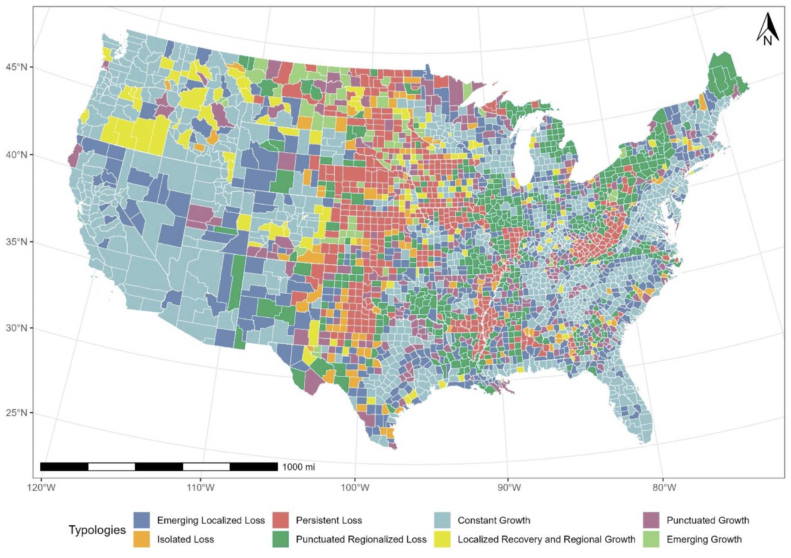
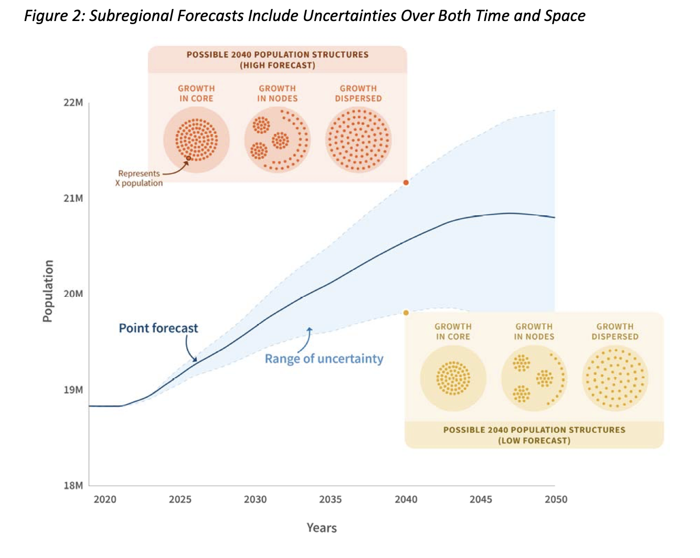
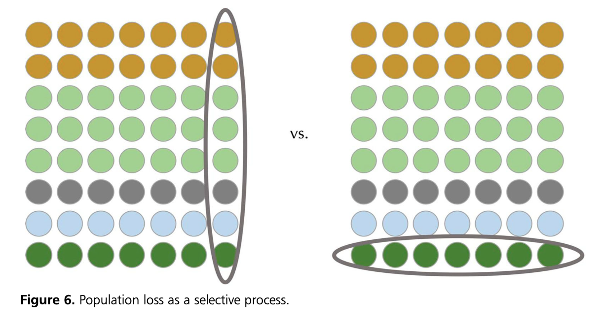
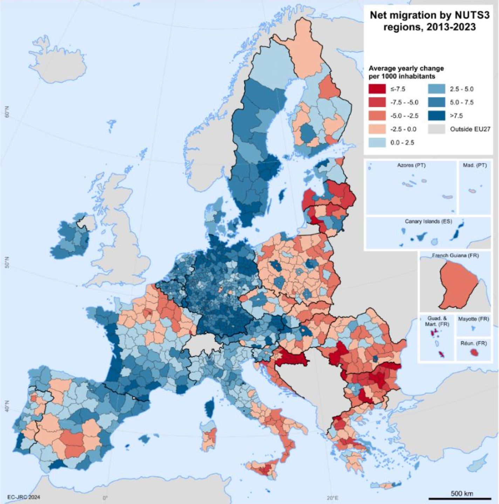
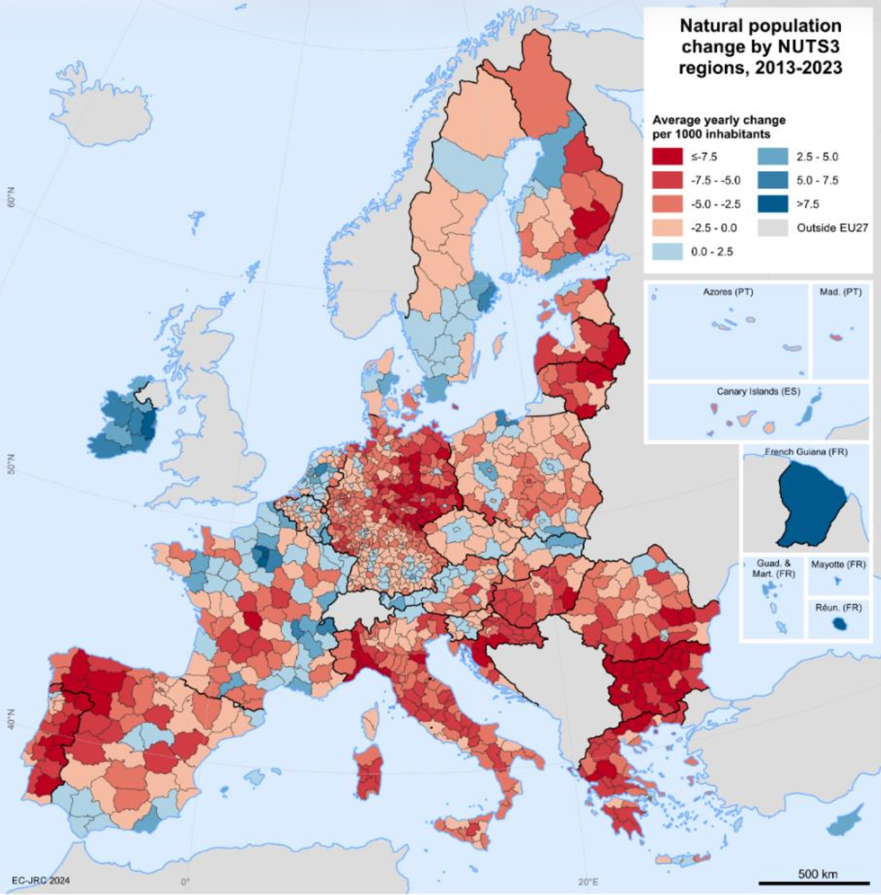
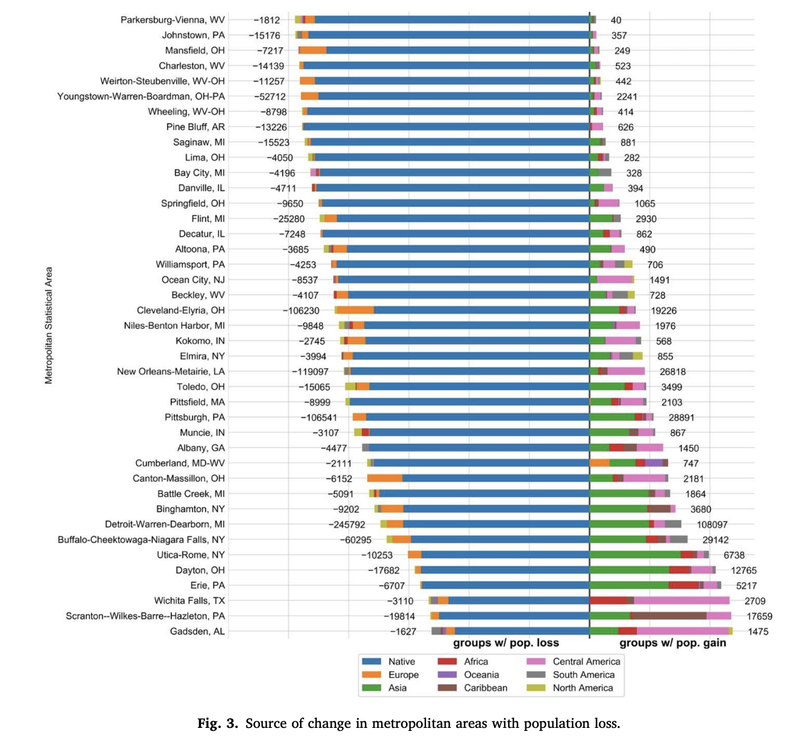
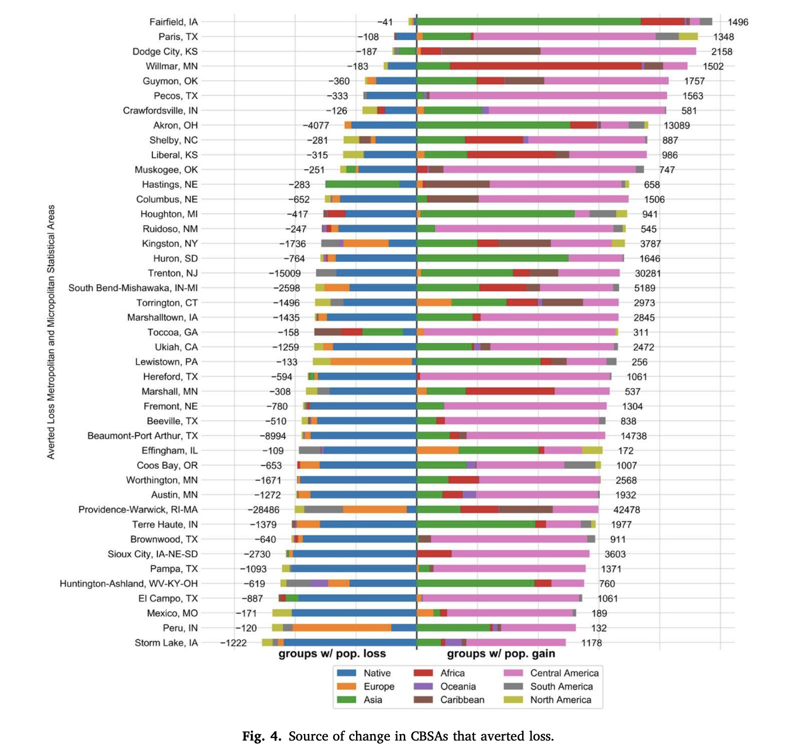

# [Anyone who believes that exponential growth can go on forever in a finite world is either a madman or an economist.]{style="color: #800020"} {.center}

::: {style="text-align: right"}
---Kenneth Boulding
:::

# [1.]{style="color: #800020"} A [rising tide]{style="background-color: #F0E68C"} lifts all ~~boats~~ MPOs

## We're accustomed to uneven growth in a wider context of expansion. We're about to find out what happens when the tide goes out.

## 

{fig-align="center" width="70%"}

::: aside

Park, Seymour, and Franklin. (forthcoming). "Characterizing the Landscape of Loss: A Spatio-Temporal Contextual Approach to Measuring U.S. County-Level Depopulation," Annals of the American Association of Geographers

:::

# [2.]{style="color: #800020"} Siphons 
(imagine a giant---spatially and demographically distributed---sucking sound)

## One area's gains are another's loss. 

##

{fig-align="center" width="70%"}

::: aside

SCAG Technical Working Group, January, 2023

:::

## {fig-align="center"}

::: aside

Rachel S. Franklin (2020): I come to bury (population) growth, not to praise it, *Spatial Economic Analysis*, DOI: 10.1080/17421772.2020.1802056

:::

## What happens when there's nothing left to siphon?

# [3.]{style="color: #800020"} [[Cloudy]{style="background-color: #F0E68C"}] crystal balls

## Predicting the future is easier when nothing is changing much.

## Harder when the wider policy landscape is unpredictable.

# [4.]{style="color: #800020"} Magnets

## Relying on place characteristics to attract other places's people (and reproductive potential)

##

:::: {.columns}
::: {.column width="50%"}
{fig-align="center"}
:::

::: {.column width="50%"}
{fig-align="center"}

:::
::::

::: aside

TESTORI, G., FRANKLIN, R., SARACENO, P., PERTOLDI, M., PEREA MILLA FERNANDEZ, D. et al., Territories and demographic change - Regional patterns and policy approaches, Publications Office of the European Union, Luxembourg, 2026, https://data.europa.eu/doi/10.2760/4140574, JRC143332.

:::

# [5.]{style="color: #800020"} Balance Sheets

## 

{fig-align="center" width="65%"}

::: aside

Bagchi-Sen, S., Franklin, R. S., Rogerson, P., & Seymour, E. (2020). Urban inequality and the demographic transformation of shrinking cities: The role of the foreign born. Applied Geography, 116, 102168.

:::

## 

{fig-align="center" width="65%"}

::: aside

Bagchi-Sen, S., Franklin, R. S., Rogerson, P., & Seymour, E. (2020). Urban inequality and the demographic transformation of shrinking cities: The role of the foreign born. Applied Geography, 116, 102168.

:::

# [6.]{style="color: #800020"} World Cup

## Challenging the premise that, to grow, all that is required is to beat everyone else.

## Immediate takeaways

- Aging
- Below-replacement level fertility
- Housing challenges that don't evaporate with decline
- Transport demand might not either
- Regional and global interdependence
- Uncertainty

# [The End.]{style="color: #800020"}
