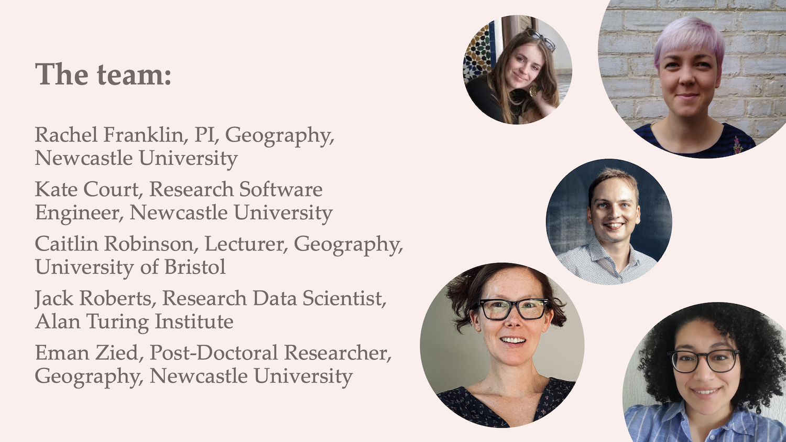
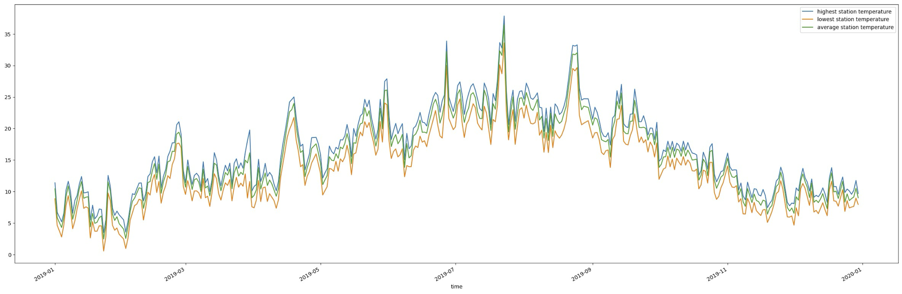
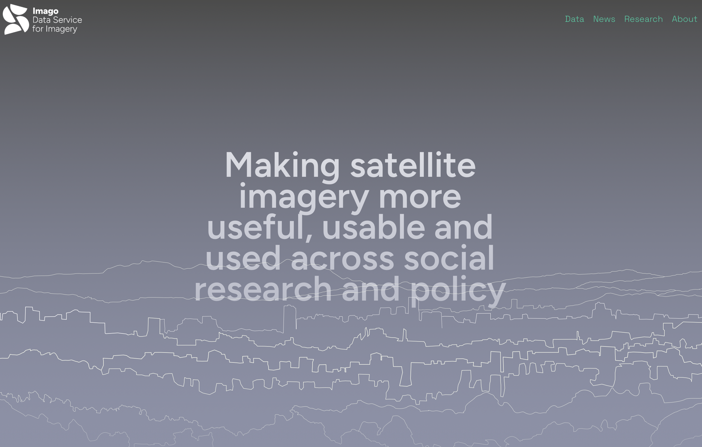
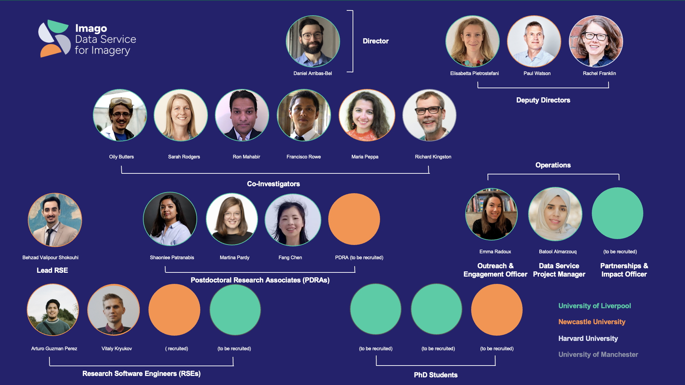

# 

Spatial Data, Data Science, and AI ... and red herrings

# An album with eight tidy tracks

-   [Side 1: The Big Picture]{style="color: #800020"}
    -   Track 1: Our data ecosystem is diverse and growing
    -   Track 2: Our breadth of methods has never been greater
    -   Track 3: Unprecedented potential
    -   Track 4: Red herrings on the path to spatial greatness
-   [Side 2: Examples]{style="color: #800020"}
    -   Track 5: Spatial inequality and the smart city
    -   Track 6: Public transportation heat exposure in a warming world
    -   Track 7: Spatial data infrastructure for the 21st century
    -   Track 8: Tying it all together

## Setting the stage (*liner notes*) {.center}

Red herring: a distraction from the real problem(s) at hand

\
\

::: aside
I'll talk about a few on my mind, a bit about how I approach this in my research, and then offer some concluding thoughts.
:::

# Side 1: The Big Picture

\

We live in exciting times for data and methods.

\

We also live in "interesting" times for applications.

\

And complicated disciplinary times.

## [Track 1]{style="background-color: #F0E68C"}: Our data ecosystem is diverse and growing

And so much more than "new and emerging forms of data"

## 

-   **Historical --** maps, diaries, inventories, censuses, surveys, archeological sites

-   **Big and smart --** sensors, social media, internet, mobility, street view

-   **Government and administrative --** census, medical, vital records, administrative

-   **Linked --** joining or nesting information across locations, time, or individual

-   **From space and from the air --** satellite imagery, aerial photography, drones, LiDAR

## Data need infrastructure

-   Not just technical -- also social

-   Requires investment and maintenance

-   Crumbles with lack of attention

-   Easily taken for granted

## [Track 2]{style="background-color: #F0E68C"}: Our breadth of methods has never been greater

\
\

::: aside
(this one's a dance tune)
:::

## 

-   "Traditional" methods to ascertain relationships and associations across variables and places, collapse data dimensionality, compare groups and outcomes

-   Data science and visualization

-   Machine learning

-   AI: computing and analytical innovations that facilitate data discovery and manipulation, text analysis, feature extraction, data creation, and analytics [*at scale*]{style="background-color: #F0E68C"}\
    \
    \

::: aside
(imagine the effort of extracting buildings and street networks from historical maps or individual trees from satellite imagery)
:::

## [Track 3]{style="background-color: #F0E68C"}: Unprecedented potential

(and challenges)

## 

-   To tackle wicked social, environmental, and health challenges

-   Increase understanding of the world around us

-   Do really interesting and innovative research

-   And train the next generation to do even better

## 

But...

\

As social scientists we can occasionally get distracted by the shiny data and methods objects. The attraction of the novel.

## [Track 4]{style="background-color: #F0E68C"}: Red herrings on the path to spatial greatness

The ways in which data and methods distract us from the real problem of improving well-being and reducing spatial inequalities.

\

This is the tortured geographer part of the talk.

\
\

::: aside
(vibey, long, end-of-first-side track)
:::

## 1. AI {.center}

## There's no such thing as AI, as in "let's use AI for this"

## Also: the problem at hand should determine the method.

(which may often be "AI"!)

## A collective challenge for us is to identify the ways in which AI, machine learning, and data science can advance knowledge and actually help make the world a better place

## Keeping in mind that opportunity costs are a real thing

## 2. Big data {.center}

## Exciting and cool, but also potentially problematic when it comes to issues of bias, representation, and privacy. We should be more open about this.

\

Examples: mobile phone data, social media, even satellite imagery

## Most novel data sources still rely on traditional data for validation. We need to be careful not to throw the baby out with the bathwater.

\

Example: socio-economic and demographic characteristics for mobility data

## I wish we talked more about the real potential to revolutionize how we collect [*traditional*]{style="background-color: #F0E68C"} forms of data, given the technology we have access to.

## Data and data infrastructure can be lost.

## 3. AI and big data together

## A match made in heaven and so much potential. But also so much temptation to put the cart before the horse.

# Side 2: Examples

## [Track 5]{style="background-color: #F0E68C"}: Spatial inequality and the smart city

## 

Thinking about how **emerging technologies** intersect with the **spatial demography of cities** to exacerbate, reproduce, and generate inequalities across areas or groups.

## Especially placement of sensors in the urban landscape

-   Sensor coverage and “sensor deserts”
-   Who’s in the “gaps”
-   Promoting equitable decision-making

## Even with good intentions infrastructures miss people and places

{fig-align="center" width="80%"}

## The big idea

How can we support informed and equitable decision-making around sensor placement, especially what criteria *ideal* networks might satisfy and the inevitable trade-offs involved?

## We've got good optimization algorithms for this

-   What is the ”best” allocation of *n* sensors, given a particular goal?

    -   **Single objective greedy algorithm**: Place sensors one by one and maximize coverage of one sub-group only.
    -   **Multi-objective genetic algorithm (NSGA2)**: Generate a spectrum of networks representing the coverage trade-offs between different sub-groups.

-   Decision support tools that visualize options and trade-offs

## 

## 

## Making it more user-friendly

## {fig-align="center"}

## No fancy data here and well-known methods

\
\
But should make us think:

a)  how are our (air quality) data produced?

b)  how can we do better?

## {fig-align="center"}

## [Track 6]{style="background-color: #F0E68C"}: Public transportation heat exposure in a warming world

## 

Thinking about how **health**, **climate change**, and **transportation** intersect

## Case in point: The London Tube

-   The first Tube line opened in 1863 and is still running as part of the Metropolitan line
-   272 stations
-   11 lines, covering 402 kilometres
-   More than five million passengers on the busiest days

## Future heat on the London Tube

-   Only 4 out of 11 London underground lines have air conditioning systems

-   The [average summer temperature]{style="background-color: #F0E68C"} in London is expected to increase by 2.7 degrees Celsius by the 2050s

-   The probability of [heatwaves]{style="background-color: #F0E68C"} could also increase five-fold and they're expected to occur every other year

-   By 2070, the [mean maximum air temperature]{style="background-color: #F0E68C"} in the UK in August is projected to increase by up to 6 °C in summer compared to 2018

## Hot is already here: Average station temperatures in London (2019)

{fig-align="center"}

## The big idea

How can we estimate current and future heat exposure on the Tube *and* who (where) is most affected?

## Simple (and important) question with complex data requirements

-   **Who's doing the travelling?** (demographic and health characteristics)

-   **Where are they going and how do they get there?** (origin and destination flows)

-   **What's the temperature at the station and on board?** (estimated from known station-surface differentials)

## Exciting geographical data

-   **Synthetic Population Catalyst** (SPC)--A synthetic population that simulates [individual-level travel behavior]{style="background-color: #F0E68C"} (home and workplace), travel mode, demographic and socio-economic characteristics that allow us to explore heat vulnerability at the individual level

-   **Tube operation timetable**--For [travel times and route estimation]{style="background-color: #F0E68C"}, we use the timetable provided by Transport for London (TfL) APIs. Provides accurate estimation whether travelers for each OD-pair will take air-conditioned Tube lines

-   **Clim-recal**--Estimates [weather and heat wave days]{style="background-color: #F0E68C"} in the past *and* future on a daily basis in 2.2 km\*2.2 km cells covering the entire UK. Local variation in the dataset is used to estimate heat exposure more accurately.

## Geography of hot Tube transport

{fig-align="center" width="80%"}

## Inequity of impacts aren't only spatial

-   More vulnerable populations are (slightly more) impacted

-   Non-white ethnicities also (slightly more) impacted

-   Unable to really look at age, which is a big deal

## What if we fix it?

-   A cool thing is that we can test policy changes: what if AC is installed on certain lines?

## 

-   The inequality of heat exposure risk is significant in spatial terms

-   Trickiness of estimation but lots of useful **data** that can be brought to bear

-   An exemplary example of where geographers have a lot to contribute

-   [**But** also some of this should be being measured directly!]{style="background-color: #F0E68C"}

## {fig-align="center"}

## [Track 7]{style="background-color: #F0E68C"}: Spatial data infrastructure for the 21st century

Making satellite imagery data *usable*, *useful*, and *used* in the social sciences, health, and policy

## The big idea

We've now got the compute, methods, and sensor quality for satellite imagery to be a game-changer for social science and health research and policy making

## {fig-align="center"}

## The ESRC SDR Imagery Data Service\*

**1. Imagery innovation**--research-ready [imagery-based data products]{style="background-color: #F0E68C"}, building off and developing innovative computing and AI methods that facilitate efficient automated workflows for measures and indicators

**2. Data for all**--[data distribution channels]{style="background-color: #F0E68C"} that meet researchers and policymakers where they are

**3. Capability and community**--[building capacity]{style="background-color: #F0E68C"} for understanding and working with imagery and imagery-derived data

\
\

::: aside
\*Code name: *Imago*
:::

## {fig-align="center"}

## [Track 8]{style="background-color: #F0E68C"}: Tying it all together

## What's the big deal

AI and novel data are true game changers

-   Novel insights and applications

-   Data (and methods to exploit that data) that give us completely new views into human behavior and preferences

-   *At scale*

-   Useful but also [fun]{style="background-color: #F0E68C"}

## What keeps me up at night

-   Industry- versus publicly-owned data

-   Lack of investment into novel forms of *public* data

-   Preoccupation with fast, new, shiny instead of slow, theoretically grounded and perhaps actually impactful

-   Bandwagons (AI or otherwise)

-   Spillover effects: on publication, hiring, external research funding...

## The question should determine the method   (and the data).

\

(Not the other way around)

## Complex spatial inequality challenges require complex approaches[^1]

[^1]: not necessarily complex methods

-   Inter-disciplinarity
-   Data integration
-   Theory
-   A lot of social science under the hood [^2]\
    \

[^2]: starting with a question, building with theory, and then selecting the most appropriate methods

# The End.

::: aside
Thank you!!
:::
