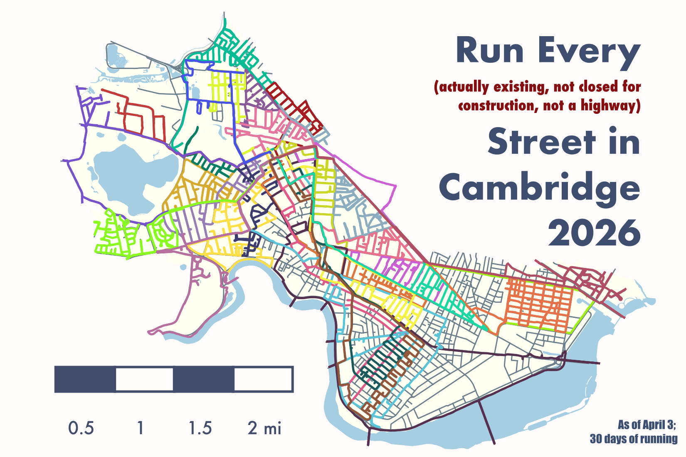
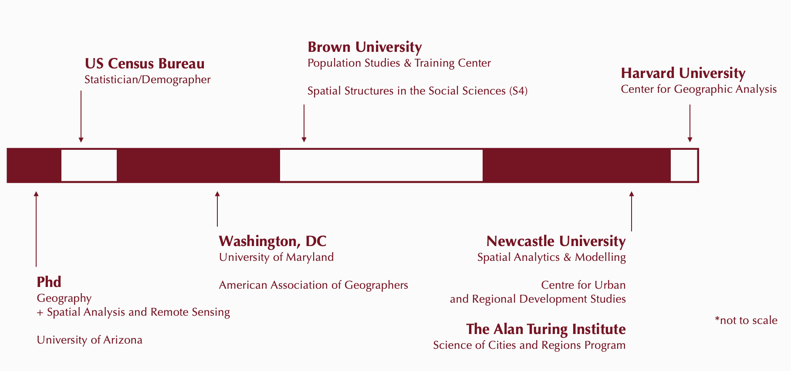
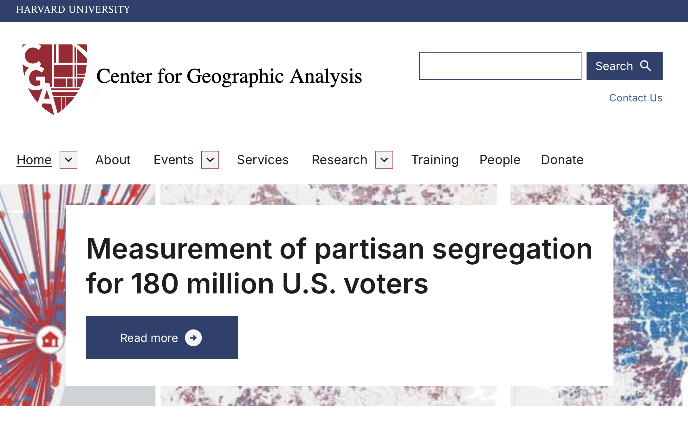
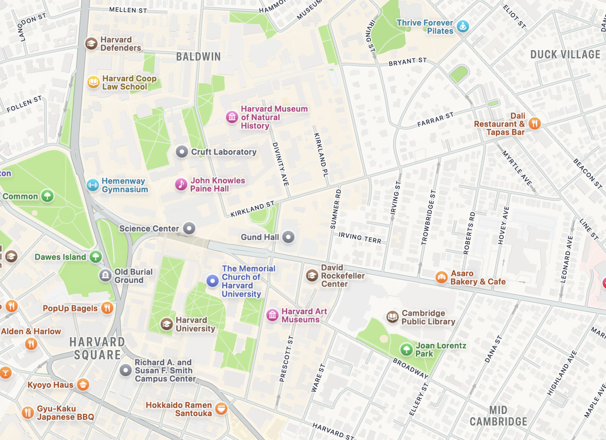
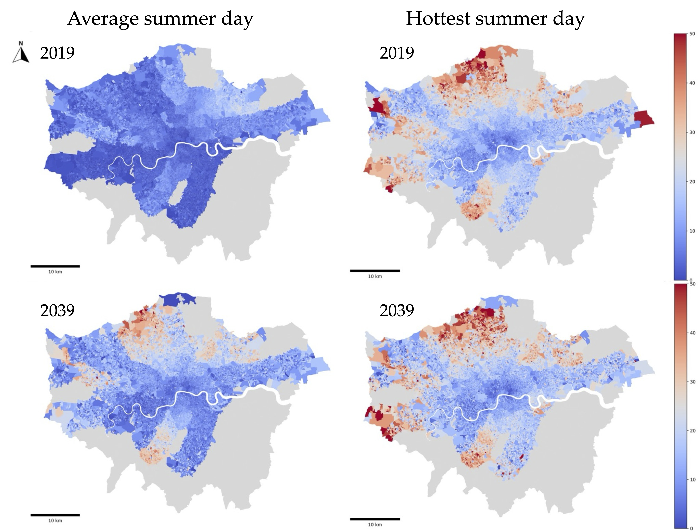
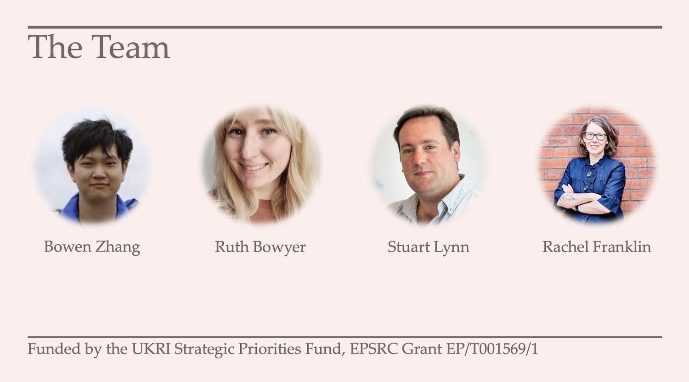
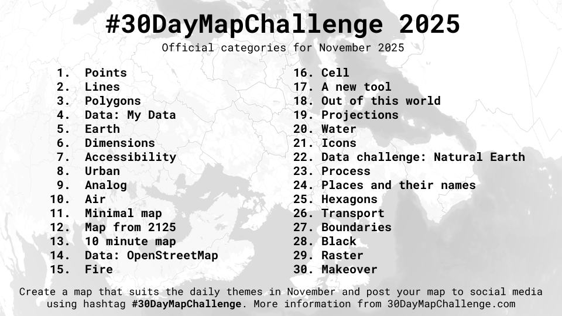
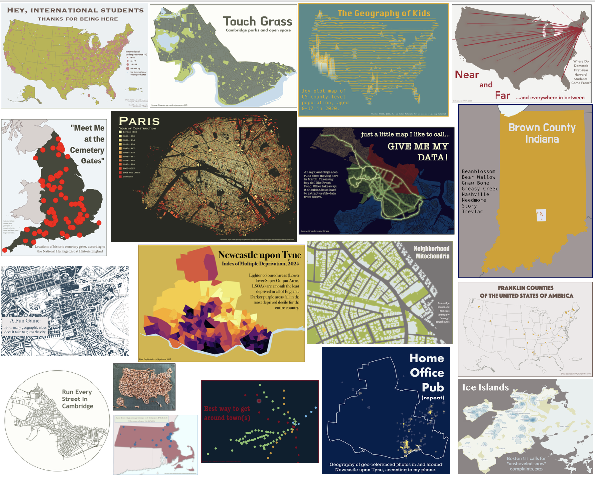

# First things first
Silly maps as praxis

## {fig-align="center"}

# Why we're all here: 
a collective quest for mappiness

##

[mappiness]{style="background-color: #F0E68C"} (noun): the pursuit of spatial understanding, usually with data and spatial analytic methods, that is creative, useful, and fulfilling. Could be individual or collective.

## Stuff about our quest (i.e., the structure of this talk)

- Your guide (that's me!)
- The mission
- Optional side-quests
- Helpers along the way
- The fellowship of the map

# Your guide (on today's quest)

## {fig-align="center"}

## The Center for Geographic Analysis (CGA) at Harvard

{fig-align="center"}

# The mission
(should we choose to accept it)

\

Building and maintaining the networks (social, infrastrucutural, and technical) to enable mappiness for ourselves, our workplaces, and the world around us, for today *and* tomorrow.

## Requires ["spatial practice"]{style="color: #800020"}
\
[1.]{style="color: #800020"} Working with, managing, transforming, visualizing, communicating, and teaching about spatial information, data, and questions.

\
[2.]{style="color: #800020"} Actual practice doing the thing (mapping, analyzing, interpreting). 

## And also ["communities"]{style="color: #800020"}
\
[1.]{style="color: #800020"} Requires multiple types of expertise and backgrounds---disciplinary, but also faculty, staff, students, etc.

\
[2.]{style="color: #800020"} Building networks, increasing visibility, and expanding capacity.

## Our mission fits within a wider, dynamic landscape
\

Exciting times for spatial data and methods---new data! new methods!

\

"Interesting" times for applications---there's never been more need for spatial expertise

# Side-quests
Diversions and secondary goals

## [Side-quest 1]{style="background-color: #F0E68C"}: Data

So much more than "new and emerging forms of data"

## 

-   **Historical --** maps, diaries, inventories, censuses, surveys, archeological sites

-   **Big and smart --** sensors, social media, internet, mobility, street view

-   **Government and administrative --** census, medical, vital records, administrative

-   **Linked --** joining or nesting information across locations, time, or individual

-   **From space and from the air --** satellite imagery, aerial photography, drones, LiDAR

## Data need infrastructure

-   Not just technical---also social

-   Requires investment and maintenance

-   Crumbles with lack of attention

-   Easily taken for granted

## [Side-quest 2]{style="background-color: #F0E68C"}: Methods

##

-   "Traditional" methods to ascertain relationships and associations across variables and places, collapse data dimensionality, compare groups and outcomes

-   Data science and visualization

-   Machine learning

-   AI: computing and analytical innovations that facilitate data discovery and manipulation, text analysis, feature extraction, data creation, and analytics [*at scale*]{style="background-color: #F0E68C"}\
    \
    \

::: aside
(imagine the effort of extracting buildings and street networks from historical maps or individual trees from satellite imagery)
:::

##

{fig-align="center"}

## [Side-quest 3]{style="background-color: #F0E68C"}: Demand

##

-   Actually tackling wicked social, environmental, and health challenges

-   Increasing understanding of the world around us

-   Doing really interesting and innovative research

-   And training the next generation to do even better

## [Side-quest 4]{style="background-color: #F0E68C"}: An applied adventure

## 

Public transportation heat exposure in a warming world

## 

Thinking about how [**health**]{style="color: #800020"}, [**climate change**]{style="color: #800020"}, and [**transportation**]{style="color: #800020"} intersect

## Case in point: The London Tube

-   The first Tube line opened in 1863
-   272 stations
-   11 lines, covering 402 kilometres
-   More than five million passengers on the busiest days

## Future heat on the London Tube

-   Only 4 out of 11 London underground lines have air conditioning systems

-   The [average summer temperature]{style="background-color: #F0E68C"} in London is expected to increase by 2.7 degrees Celsius by the 2050s

-   The probability of [heatwaves]{style="background-color: #F0E68C"} could also increase five-fold

-   By 2070, the [mean maximum air temperature]{style="background-color: #F0E68C"} in the UK in August is projected to increase by up to 6 °C in summer compared to 2018

## Hot is already here: Average station temperatures in London (2019)

{fig-align="center"}

## The task

How can we estimate current and future heat exposure on the Tube *and* who (where) is most affected?

## Simple (and important) question with complex data requirements

-   **Who's doing the travelling?** (demographic and health characteristics)

-   **Where are they going and how do they get there?** (origin and destination flows)

-   **What's the temperature at the station and on board?** (estimated from known station-surface differentials)

## Geography of hot Tube transport

{fig-align="center" width="80%"}

## 
An exemplary example of spatial research and community

{fig-align="center"}

# Obstacles and challenges

What's going to prevent us from achieving our mission?

## [1.]{style="color: #800020"} Neutral role for AI {.center}

A collective challenge is identifying the ways in which AI, machine learning, and data science can advance knowledge and actually help make the world a better place

\

And it's all changing so fast---a brave new world, in many ways

\

Opportunity costs are a real thing

## [2.]{style="color: #800020"} Bigger data, bigger problems {.center}

## Exciting and cool, but also potentially problematic when it comes to issues of bias, representation, and privacy. 

\

Examples: mobile phone data, social media, even satellite imagery

## Most novel data sources still rely on traditional data for validation. 

\

Example: socio-economic and demographic characteristics for mobility data

## [3.]{style="color: #800020"} Money, money, money

\

Tighter university budgets, shifting research funding priorities

\

Building communities of spatial practice requires resources and working across disciplines sometimes means no one claims ownership

## [4.]{style="color: #800020"} Communication, communication, communication

\

How do people (students, researchers, general public) find out what we're doing and how we can help?

\

Highlighting the importance of a spatial perspective, as well the quotidian tasks of where to find data, how to answer spatial questions, etc.

# Helpers along the way

## Shout outs

- Open source software, but especially tutorials and training

- Open data and robust data infrastructure

- University centers that serve as spatial community glue

## A personal favorite: The 30 Day Map Challenge

\

Because what is [mappiness]{style="background-color: #F0E68C"} without maps?

\

Also a great example of spatial [practice]{style="color: #800020"} *and* [community]{style="color: #800020"}

## 

{fig-align="center"}

## 

{fig-align="center"}

# The Fellowship of the Map

## Takeaway thoughts

- It takes a village to make a map
- Community operates at multiple scales and each is valuable
- We shouldn't ignore the side-quests---importance of data and methods
- Life-long learning for life-long mappiness

# The End.

Thank you!!
