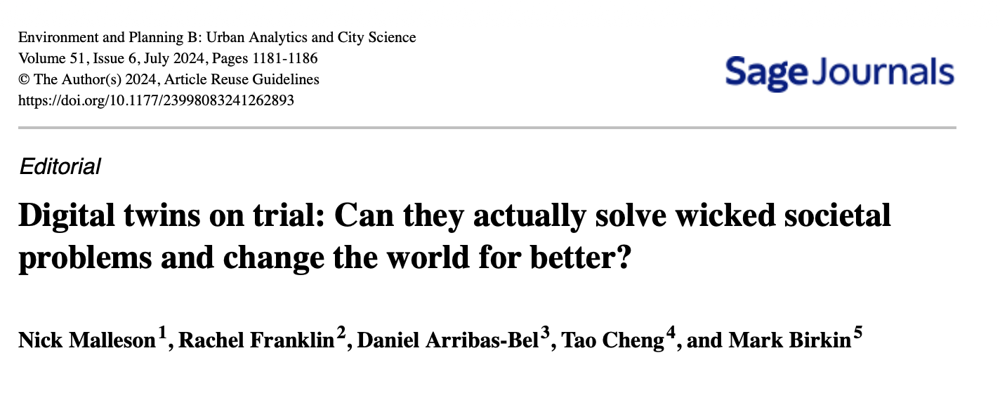

# [1]{style="background-color: #E9BDB4"} What we talk about when we talk about digital twins

## 

- [Need]{style="background-color: #E9BDB4"}: They fill a gap!

- [Physical Foundations]{style="background-color: #E9BDB4"}: They foreground the physical components of cities (like transport networks and the built and natural environments)

- [Efficiency]{style="background-color: #E9BDB4"}: Yay efficiency!

- [Scenarios]{style="background-color: #E9BDB4"}: They open the door to richer what-if scenario testing.

- [Uncertainty]{style="background-color: #E9BDB4"}: They can help reinforce the importance of model uncertainty

- [Appeal]{style="background-color: #E9BDB4"}: It's rare a modelling framework or paradigm attaches itself so firmly and so widely to such a variety of domains (public, private, academic) and areas (infrastructure, land use, transport). [This is not to be discounted lightly.]{style="background-color: #E9BDB4"}

# [2]{style="background-color: #E9BDB4"} What keeps me up at night

## Just kidding

## No but really

- [Lack of demographic, economic, and social process]{style="background-color: #E9BDB4"}: They ‘rarely include any of the processes that determine how the city works in terms of its social and economic functions’ (Batty, 2018).

- [Society at Scale]{style="background-color: #E9BDB4"}: What does a social DT look like? How can individuals, communities, and policies be captured and presented in a DT?

- [Mutability]{style="background-color: #E9BDB4"}: When urban physical systems change, the sources of that change are typically straightforward to identify. Humans are more difficult.

- [Scalability]{style="background-color: #E9BDB4"}: Wicked societal problems are wicked because they are complex and big

- [Time horizons]{style="background-color: #E9BDB4"}: City DTs and other DTs work at a time scale consisting of minutes, days, and months, using real-time data to fine-tune immediate responses. This is not the time scale of wicked urban and social problems

- [Technocracy]{style="background-color: #E9BDB4"}: The greatest risk that DTs pose may be precisely what makes them so popular: the promise that they are a panacea for a range of challenges that other approaches – and policy and investment – have failed to resolve.

# [3]{style="background-color: #E9BDB4"} Promise and potential

## 

- Data, compute, and real time aren't going anywhere

- Reckoning with data (access, bias, privacy) also isn't going anywhere

- Rallying points are valuable (this is kind of a big deal)

- Digital Twins try to respond to a clearly identified need/gap (also a big deal)

## 

::: {layout="[70,30]"}

{width="30%"}
:::
