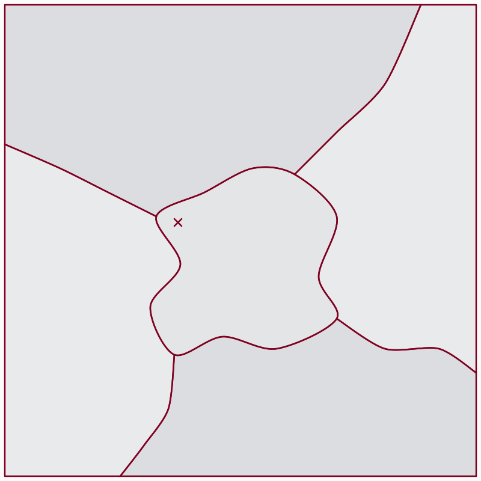
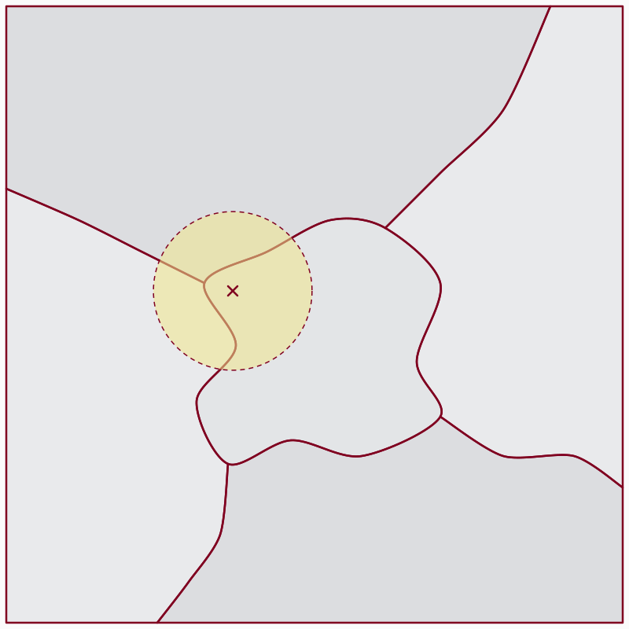
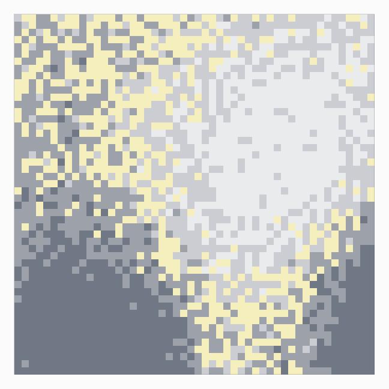
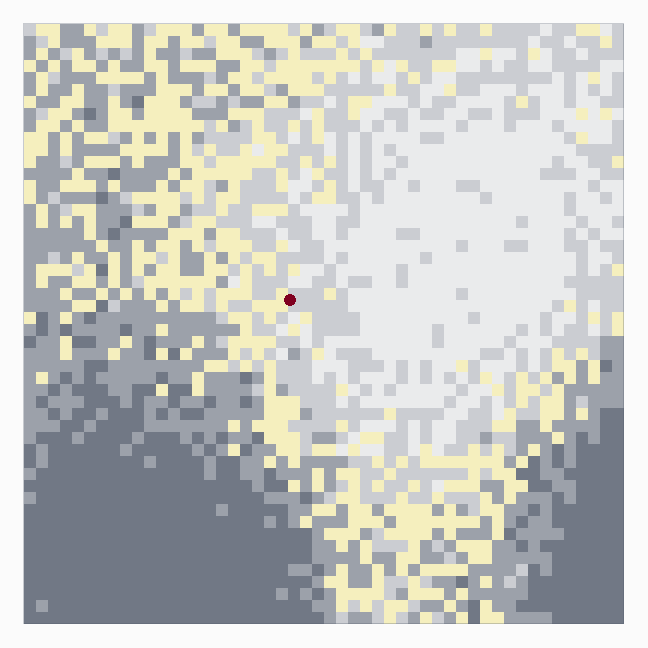
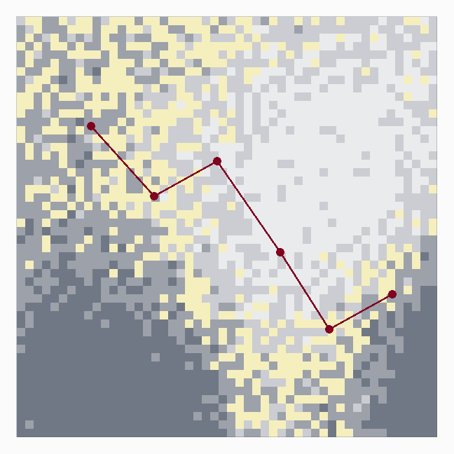
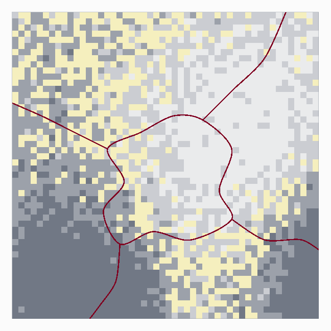
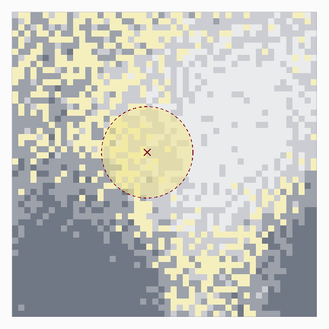
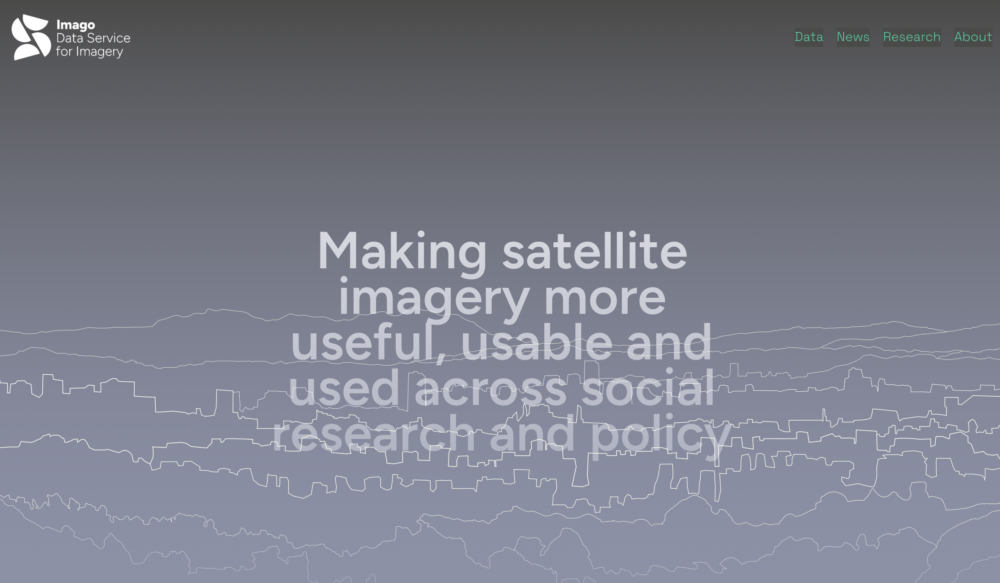
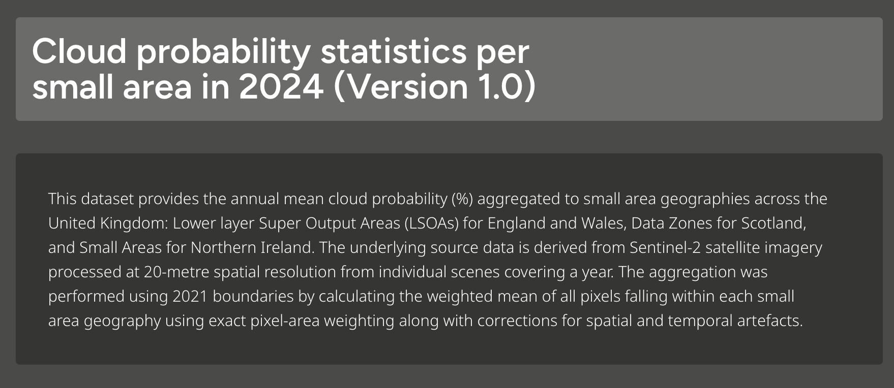

# Disclaimer
I'm not here on behalf of the anti-pixel lobby

## This is a talk about how we leverage the [magic of satellite imagery]{style="background-color: #F0E68C"} for social science research.

# Main argument
Satellites are a game changer but require careful thinking about how we believe [place]{style="color: #800020"} matters and this has implications for both [theory and data]{style="background-color: #F0E68C"}.[*]{style="color: #800020"}

\
\

::: aside
[*]{style="color: #800020"} These issues aren't new, even if the data are.
:::

# What I'm going to talk about

- Geography
- Some aspects of measuring place
- How [pixels]{style="color: #800020"} can help
- A quick example

# But first

## Some ways we are interested in ["place"]{style="color: #800020"}

##

\

Why is this [place]{style="color: #800020"} more developed, happier, healthier than that one?

## 

\

Which [places]{style="color: #800020"} are most vulnerable to effects of economic crisis or climate variability?

## 

\

Why do people move from this [place]{style="color: #800020"} to that one?

## 

\

How is this [place]{style="color: #800020"} changing over time?

## 

\

How do [place]{style="color: #800020"} conditions affect outcomes...for people, businesses, policies?

## 

\

What hazards are individuals exposed to as they move through these [places]{style="color: #800020"}?

# Spatial data helps us do better at understanding and measuring [place]{style="background-color: #F0E68C"}

## Traditional data (often also spatial!)

- Foundational role in social science research
- Reliable for socio-demographic characteristics
- Trade-off between location and individual information
- Rigid conceptualization of place (which is often just fine for us!)
- Only periodic updates

## Novel forms of spatial data

- Frequent updates, maybe even real time
- More fine-grained, exact location
- Potentially greater insight into individual movement, behaviors, preferences
- Often spatially and socio-economically selective
- [In many cases more applicable for placing individual movement, behaviors, preferences within a context, than actually measuring that context]{style="color: #800020"}

## A exception: satellite imagery

- [x] Fine-grained location
- [x] Almost universal spatial coverage
- [x] Frequent temporal updates
- [x] Provides data for areas of Earth---sounds like a [place]{style="color: #800020"}!
\
\
\
So where's the problem?

# Geography

## There are lots of ways social scientists use geography

\

Different applications demand different conceptualizations

# Place

\
Has political, economic, and/or psychological valence. Often has a name.
\
\
Could be formal and administratively defined, like a statistical unit, or could be perceptual, like your neighborhood.
\
\
Boundaries matter.

## As researchers, we often don't control the definition of a place

- Geographies are "off the shelf"
- Our challenge is data. What are places like?
  - Traditional data give only an incomplete picture
  - A gap emerges for novel types of data to fill

# Pixel

\
The unit upon which satellite images (and photos) are based. Resolution and boundaries are determined by a [machine in space]{style="background-color: #F0E68C"}. Boundaries are arbitrary and meaningless.

## Pixel size, sensor, and post-processing together will determine what we "see" for a particular location.     We are unlikely to go out and look for other data for that geography.

# Context

\
Spatial influence on some outcome of interest (like education or health). Could be a place!
\
\
([probably isn't a pixel]{style="background-color: #F0E68C"})

## Context is possibly the toughest: how do we know the [spatial zone of influence]{style="background-color: #F0E68C"} and how do we get data that matches that geography?

## Lots of other geographical concepts too

- [**Location**]{style="color: #800020"}: Attaching information to a point, line, or polygon
  - Information could come from pixels...or not...
- [**Trajectory**]{style="color: #800020"}: Movement through space
  - We often want to estimate exposures, influences, or contexts for routes or movement
  - Pixel could make sense...or not...
- [**View-shed**]{style="color: #800020"}: What can we see from here?
  - Inherently pixel-based

# Some aspects of measuring [place]{style="color: #800020"}

## What are the spatial mechanisms or relationships we're hypothesizing?

{fig-align="center"}

## Are there undefined or fuzzy boundaries?

{fig-align="center"}

## Not always: administrative versus perceptual

:::: {.columns} 
::: {.column width="50%"}

{fig-align="center"}
:::

::: {.column width="50%"}

{fig-align="center"}

:::
::::

## However, place can be ego-centric and uncertain

{fig-align="center"}

## However, place can be ego-centric and uncertain

{fig-align="center"}

## So far, so good

\
Research should be grounded in a conceptualization of [place]{style="color: #800020"} that suits our purposes.

\
Then we need data for these geographies.

# What do [pixels]{style="color: #800020"} have to do with it?

## Pixels aren't places but they [are]{style="color: #800020"} pretty cool

:::: {.columns} 
::: {.column width="50%"}

{fig-align="center"}
:::

::: {.column width="50%"}

\
\

- Leaving aside the breadth of metrics and information they can provide
- Uniform spatial building blocks
- Flexible aggregation power
- In short: **we can make places from pixels**

:::
::::

# And sometimes a pixel is just a pixel

## Getting the big picture (literally)

{fig-align="center"}

## What was the temperature at a particular point?

{fig-align="center"}

## What about heat exposure along a route?

{fig-align="center"}

# Getting from pixel to place

## We can aggregate pixels to known [place]{style="color: #800020"} geographies

{fig-align="center"}

## And hypothesized local contexts (this is great!)

{fig-align="center"}

# A quick example

\
\
\

::: aside
with very special thanks to Shaonlee Patranabis!
:::

##

{fig-align="center"}

## Predicting neighborhood cloudiness

- Clouds affect everything from surface temperatures to mental well-being to (probably) local spending
- Traditional data are not capable of providing cloudiness data
- [Satellites are!]{style="background-color: #F0E68C"}

## Predicting neighborhood cloudiness

:::: {.columns} 
::: {.column width="40%"}

\
\

- However, makes no sense to look at cloudiness at the pixel level
  - [PIXELS AREN'T PLACES]{style="background-color: #F0E68C"}
- The magic is not only the data (probability of cloudiness) but the power of the pixel

:::

::: {.column width="55%"}

{fig-align="center"}

:::
::::

## Presenting Sun Probability Framework (SPF) for the UK

{fig-align="center"}

# {data-background-iframe="https://itsshaonlee.github.io/imago-spf-explorer/app/" data-background-interactive="true"}

# Parting thoughts I

- We talk a lot about the potential of satellite imagery (and other spatial data)
- Conversation often revolves around what *new* information, or data, imagery can provide
- Or other advances in frequency, coverage, etc.
- All of this is true

# Parting thoughts II

- An under-appreciated aspect of imagery, though, is its chameleon-like ability to aggregate to geographies we use in the social sciences
- With a few caveats:
  - We need to understand what sorts of [places]{style="color: #800020"} we're working with
  - We typically don't need the data in pixels
  - Instead, what is needed is [pixel-based data for places]{style="background-color: #F0E68C"}[*]{style="color: #800020"}
  
::: aside
[*]{style="color: #800020"} Pixels have their place!
:::

# Parting thoughts III

- Different data or more data doesn't obviate the need for a solid conceptual foundation
- Geography and space have an important role to place in social science research
  - Spatial inequalities, exposure, vulnerability---all of these have strong spatial components
- BUT this means the onus is on us to think carefully about spatial relationships and mechanisms. 
  - What kind of place are we talking about?
  - At what scale do we think causes or inputs are operating?
- Good news is that, increasingly, we can locate the data we need for the [places]{style="color: #800020"} we're working with.

# The End.

\

rachel_franklin@cga.harvard.edu

\

https://www.rachelfranklin.org

\

Thank you!!

