# Hello! 

# 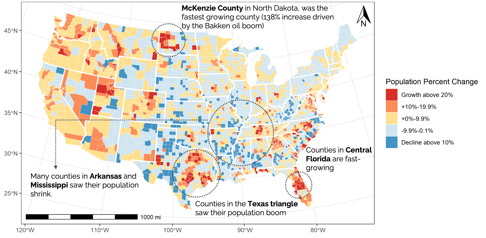{fig-align="center"}

# Lecture plan 

(a sort of double-decker example sandwich)

- ~~Example~~
- Question of the day
- Defining "GIS"
- Examples
- Spatial thinking
- GIS and spatial analysis
- Examples

# Question of the day
\
How would you characterize the "ideal" place to live?

\

{fig-align="center"}

# Question of the day

\

How would you characterize the "ideal" place to live?

\
\

Bonus: How would you measure it?

# What are we talking about when we talk about "GIS"

1. "Geographic Information Systems" -- software or packages that work with spatial data to visualize and analyze spatial data (e.g., ArcGIS Pro, QGIS, R, or Python)

2. Entire quantitative approaches to spatial questions and data -- spatial analysis

3. A combination of spatial thinking, analysis, and data -- for example, accessibility research

## What someone might mean when they say, "you should use GIS for this"

- Spatial analysis
- Visualization
- Geographic data science
- AI/machine learning

## OK, so what can we do with GIS?

-   **Visualize data ** -- for example, exploratory mapping or cartography of Airbnb rentals within a city
-   **Explore geographic coincidence** -- for example, air quality and transportation routes
-   **Calculate geometries** -- for example, length of road in an area or the size of a polygon
-   **Identify spatial patterns** -- for example, clusters or hot spots
-   **Find spatial relationships** -- for example, measuring exposure, accessibility, or market areas
-   **Calculate spatial variables** -- for example, distance, density, or nearest neighbors
-   **Estimate values or density** -- for example, interpolation

# Examples

## The first spatial analysis: John Snow’s 1854 Cholera Map

{fig-align="center"}

## Mappiness

{fig-align="center"}

##

{fig-align="center"}

##

{fig-align="center"}

# Thinking spatially

## Common kinds of spatial questions

##

{fig-align="center"}

##

{fig-align="center"}

## How does a variable or phenomenon vary over space? 

{fig-align="center"}

## How is distance to public transportation related to Airbnb price? 

{fig-align="center"}

## Do we observe clustering of Airbnbs? 

{fig-align="center"}

##

{fig-align="center"}

## 

How are local rents and density of Airbnbs related? 

# There are so many ways to think about space

## 

{fig-align="center"}

# And so many ways to analyze spatial relationships and entities

## Often we use spatial analysis tools to *extract* information

-   Length of paved road in a region
-   Number of universities in a place
-   Number of inhabitants within a distance of a service
-   Area within a distance of a road or feature (like a bus stop or metro station)

# Some common spatial analysis tools

## Buffers

\

{width="70%" fig-align="center"}

## Appealing way to visualise and calculate areas surrounding features

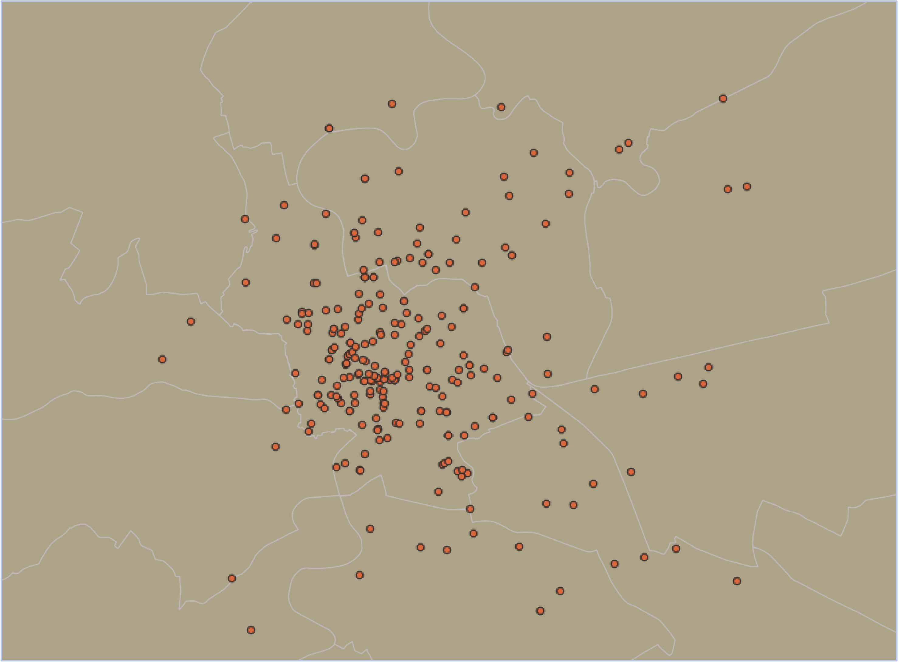{width="70%" fig-align="center"}

## Appealing way to visualise and calculate areas surrounding features

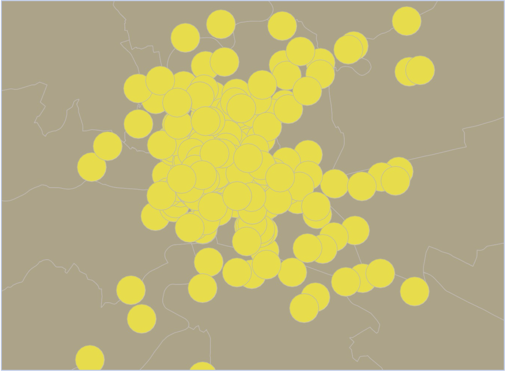{width="70%" fig-align="center"}

## Why would we want buffers? What purpose do they serve?

## Calculating how many features fall into an area

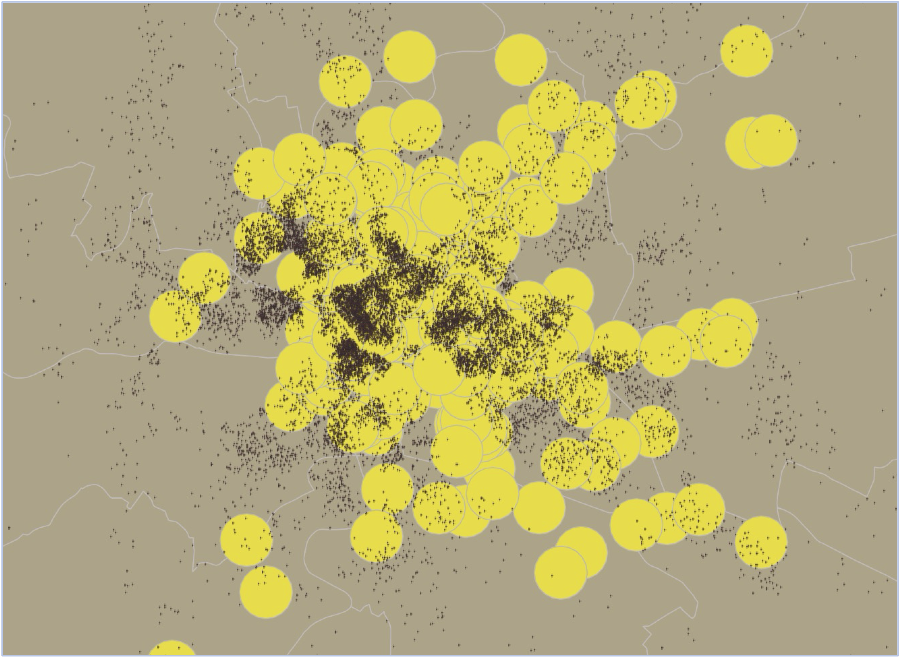{width="70%" fig-align="center"}

## What if we want to know areas where two (or more) layers overlap?

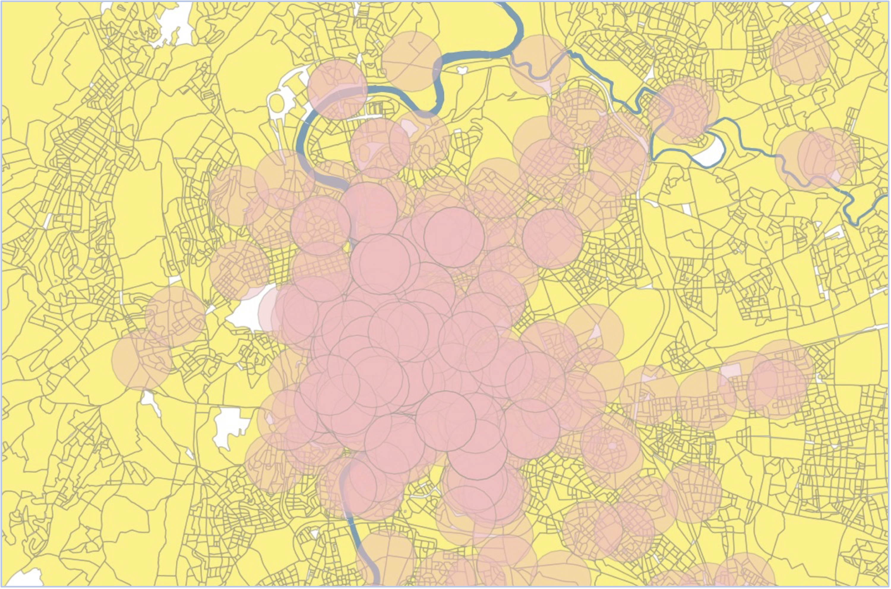{width="70%" fig-align="center"}

## What if we want to know areas where two (or more) layers overlap?

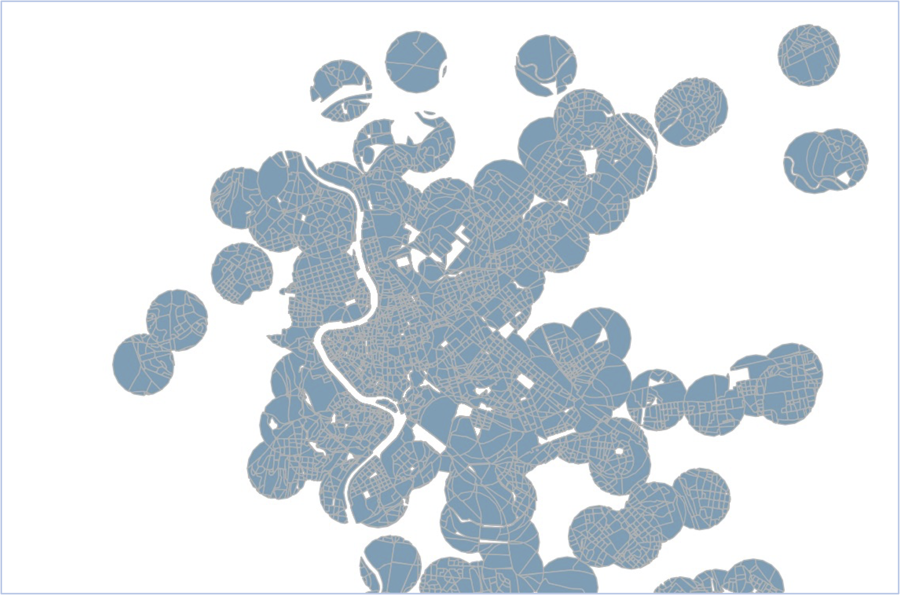{width="70%" fig-align="center"}

## What if we want to know how many people fall into an area?

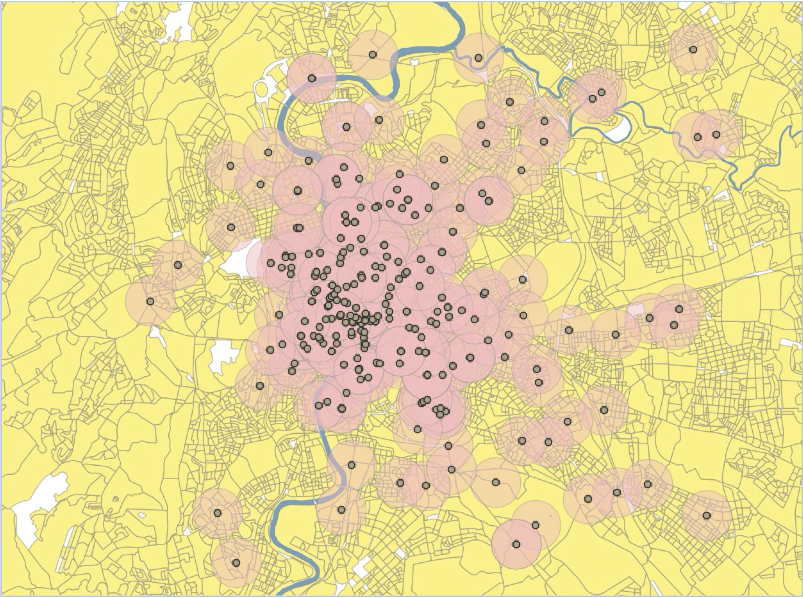{width="70%" fig-align="center"}

## How is this useful?

### What if you want to identify Airbnbs close to public transportation and water?

::: {layout-ncol="2"}
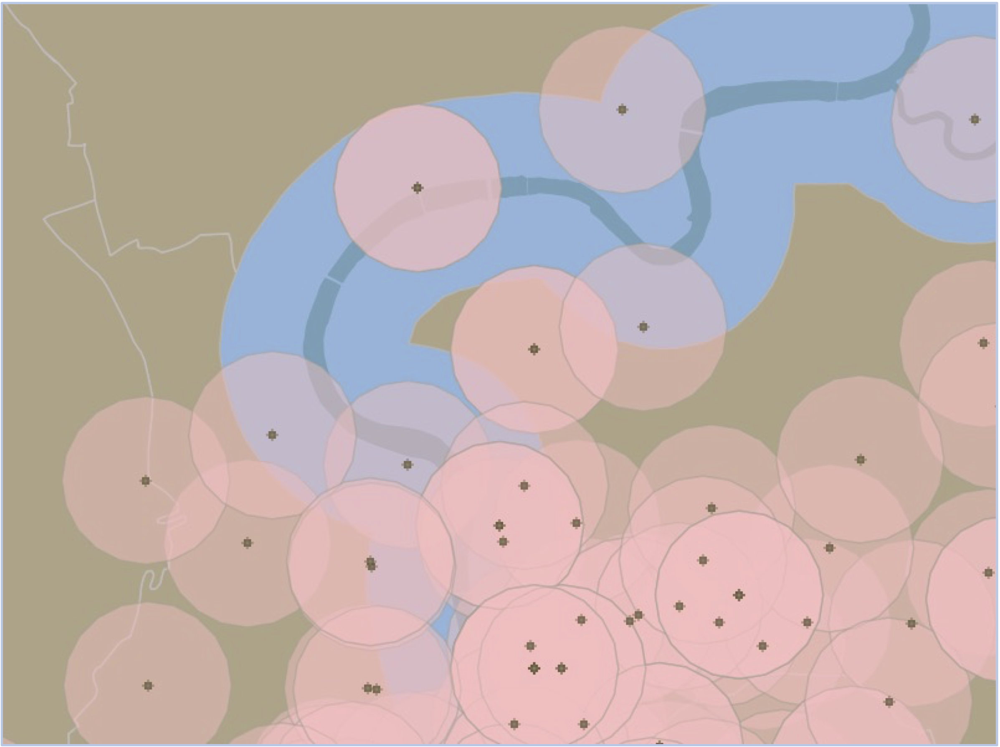

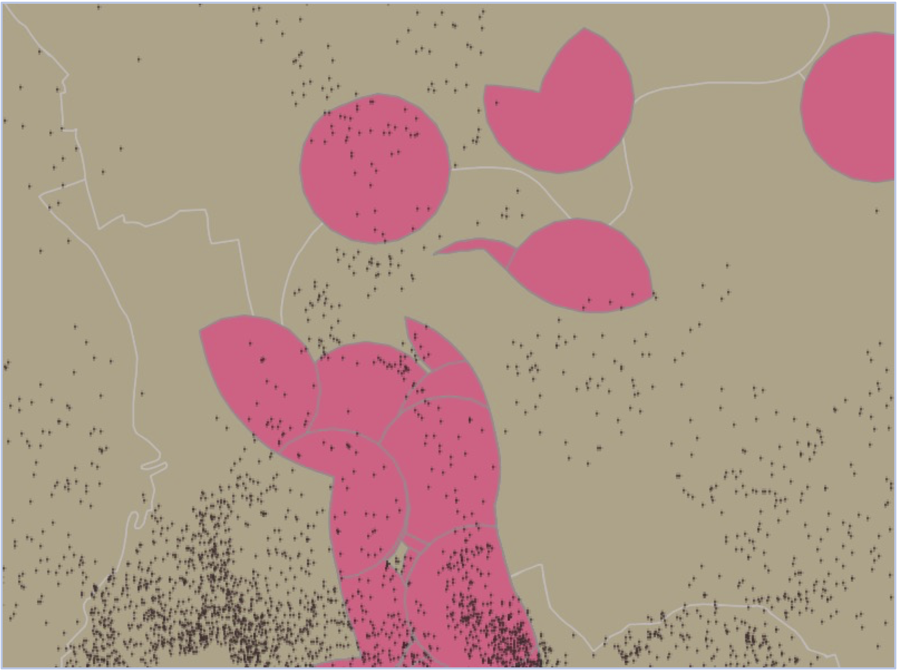
:::

# A last example

## How real estate advertising and neighborhood racial change are related
\
\

What do we need to study this?
\
\
\

::: aside
Delmelle, E. C., & Nilsson, I. (2026). The Evolution of Real Estate Advertisement Language in Racially Changing Neighborhoods. *Annals of the American Association of Geographers*, 116(3), 621–641. https://doi.org/10.1080/24694452.2025.2582615
:::

## 

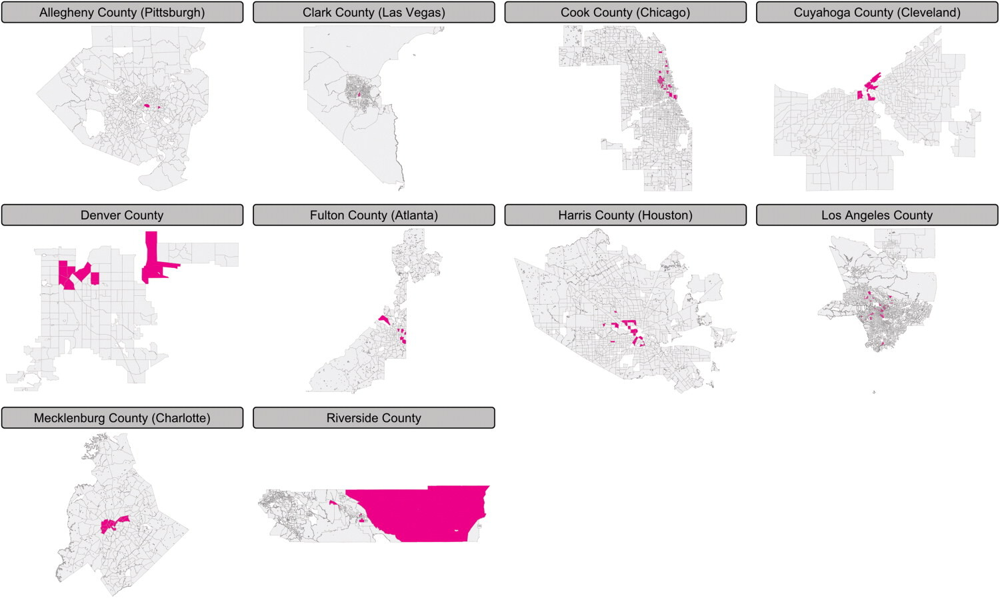

##

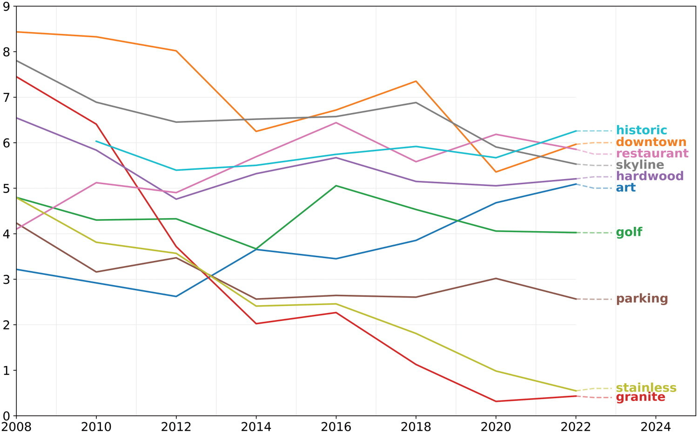

## 

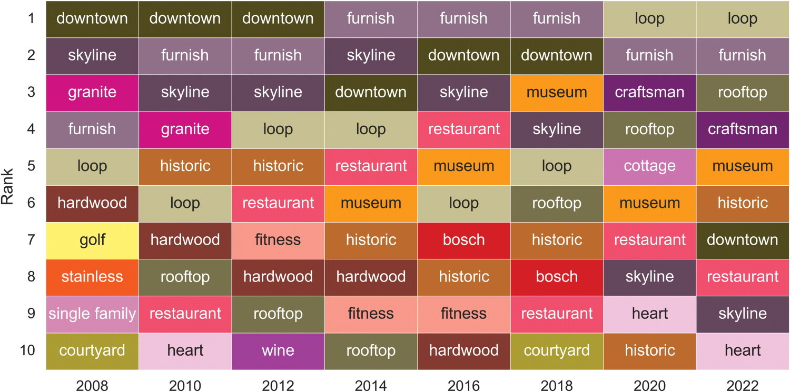

# Spatial Data Sources

- Census data (e.g., tracts or counties)
- State and city "GIS clearinghouses"
- Any data with latitude and longitude or address
- So much more...

# Tools and resources

- ArcGIS Pro and QGIS
- R and Python
\
\

- CGA training and workshops
- Harvard GIS and spatial analysis courses
- the internet!

# Thanks!

