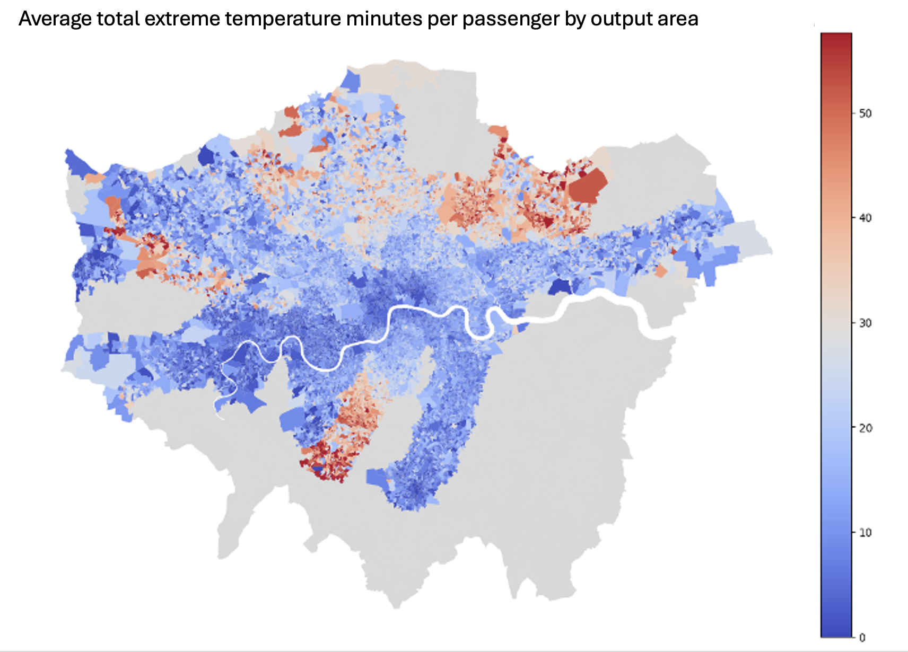
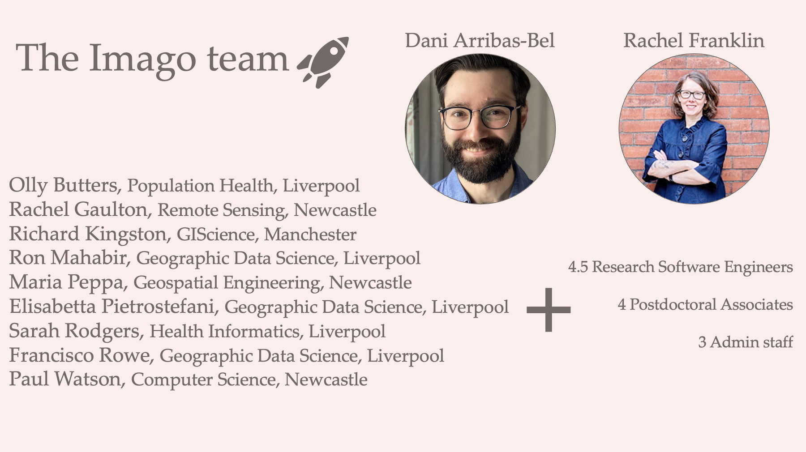

# Red herring: a distraction from the real problem at hand {.center}

::: aside
Getting to 5 might be difficult. I'm going to talk about a few on my mind, a bit about how I approach this in my research, and then offer some concluding thoughts.
:::

# The big picture {.center}

We live in exciting times for data and methods.

## Data

- **Historical --** maps, diaries, inventories, censuses, surveys, archeological sites

- **Big and smart --** sensors, social media, internet, mobility, street view

- **Government and administrative --** census, medical, vital records, administrative

- **Linked --** joining or nesting information across locations, time, or individual

- **From space and from the air --** satellite imagery, aerial photography, drones, LiDAR

## Methods

- "Traditional" methods to ascertain relationships and associations across variables and places, collapse data dimensionality, compare groups and outcomes

- Data science and visualisation

- Machine learning

- AI: computing and analytical innovations that facilitate data discovery and manipulation, text analysis, feature extraction, data creation, and analytics [*at scale*]{style="background-color: #F0E68C"}\
  \
  \

::: aside
(imagine the effort of extracting buildings and street networks from historical maps or individual trees from satellite imagery)
:::

# Unprecedented potential {.center}

To tackle wicked social, environmental, and health challenges, increase understanding of the world around us, do really interesting and innovative research, and train the next generation to do even better

## As social scientists and health researchers we can occasionally get distracted by the shiny data and methods objects. The attraction of the novel.

## The "red herrings", to me, are the ways in which data and methods distract us from the real problem of improving wellbeing and health, and reducing spatial inequalities.

# 1. AI {.center}

## There's no such thing as AI, as in "let's use AI for this"

## Also: the problem at hand should determine the method.

# 2. Big data {.center}

## Exciting and cool, but also potentially problematic when it comes to issues of bias, representation, and privacy. We should be more open about this.

## Most novel data sources still rely on traditional data for validation. We need to be careful not to throw the baby out with the bathwater.

# 3. AI and big data together

## A match made in heaven and so much potential. But also so much temptation to put the cart before the horse.

# That's three red herrings. {.center}

# The red herrings in my research life {.center}

# Red herring 1 {.center}

Spatial inequality and the smart city

## 

Thinking about how **emerging technologies** intersect with the **spatial demography of cities** to exacerbate, reproduce, and generate inequalities across areas or groups.

## Especially placement of sensors in the urban landscape

- Sensor coverage and “sensor deserts”
- Who’s in the “gaps”
- Equitable decision-making

## Even with good intentions infrastructures miss people and places

{fig-align="center" width="80%"}

## The big idea

How can we support informed and equitable decision-making around sensor placement, especially what criteria *ideal* networks might satisfy and the inevitable trade-offs involved?

## We've got good optimisation algorithms for this

- What is the ”best” allocation of *n* sensors, given a particular goal?

  - **Single objective greedy algorithm**: Place sensors one by one and maximize coverage of one sub-group only.
  - **Multi-objective genetic algorithm (NSGA2)**: Generate a spectrum of networks representing the coverage trade-offs between different sub-groups.

- Decision support tools that visualize options and trade-offs

## 

## 

## Making it more user-friendly

## {fig-align="center"}

## No fancy data here and well-known methods

\
\
But should make us think:

a)  how are our data produced?

b)  how can we do better?

## {fig-align="center"}

# Red herring 2 {.center}

Public transportation heat exposure in a warming world

## 

Thinking about the ways in which **health**, **climate change**, and **transportation** intersect

## Case in point: The London Tube

- The first Tube line opened in 1863 and is still running as part of the Metropolitan line
- 272 stations
- 11 lines, covering 402 kilometres
- More than five million passengers on the busiest days

## Future heat on the London Tube

- Only 4 out of 11 London underground lines have air conditioning systems

- The average summer temperature in London is expected to increase by 2.7 degrees Celsius by the 2050s

- The probability of heatwaves could also increase five-fold and they're expected to occur every other year

- By 2070, the mean maximum air temperature in the UK in August is projected to increase by up to 6 °C in summer compared to 2018

## Hot is already here: Average station temperatures in London (2019)

{fig-align="center"}

## The big idea

How can we estimate current and future heat exposure on the Tube *and* who (where) is most affected?

## Simple (and important) question with complex data requirements

- Travel flows (origins and destinations)

- Who's travelling? (demographic and health characteristics)

- What's the temperature on board? (estimated from known station-surface differentials)

## Exciting geographical tools

- **Synthetic Population Catalyst** (SPC)--A synthetic population and its extended AcBM (activity-based modelling) dataset that simulates individual-level travel behaviour (homeplace and workplace), travel mode, person and socio-economic factors to allow us to explore heat vulnerability at the individual level.

- **Tube operation timetable**--For travel times and route estimation, we use the timetable provided by TfL APIs. Provides accurate estimation whether travellers for each OD-pair will take air-conditioned Tube lines.

- **Clim-recal**--Estimates weather and heat wave days in the past *and* future on a daily basis in 2.2 km\*2.2 km cells covering the entire UK. Local variation in the dataset is used to estimate heat exposure more accurately.

## Preliminary results (a sense of where we're heading)

{fig-align="center" width="80%"}

## 

- The inequality of heat exposure risk is significant in spatial terms

- Trickiness of estimation but lots of useful **data** that can be brought to bear

- **But** also some of this should be being measured directly!

## {fig-align="center"}

# Red herring 3 {.center}

Making satellite imagery data *usable*, *useful*, and *used* in the social sciences and health

## The big idea

We've now got the compute, methods, and sensor quality for satellite imagery to be a game-changer for social science and health research and policy making

## Introducing the ESRC SDR Imagery Data Service\*

**1. Imagery innovation**--research-ready imagery-based data products, building off and developing innovative computing and AI methods that facilitate efficient automated workflows for measures and indicators, as well as custom-defined geographies and time periods.

**2. Data for all**--data distribution channels that meet researchers and policymakers where they are, with user-friendly interfaces, familiar file formats, linkage and integration with existing data resources

**3. Capability and community**--building capacity for understanding and working with imagery and imagery-derived data, growing the user-base and providing thought leadership, and heightening awareness and enthusiasm for the value of imagery\
\
\

::: aside
\*Code name: Imago
:::

## {fig-align="center"}

# Tying all this together

## Something that's not a red herring

AI and novel data as true game changers

## The question chooses the method (and the data).

(Not the other way around)

## Complex spatial inequality and health challenges require complex approaches[^1]

[^1]: not necessarily complex methods

- Inter-disciplinarity
- Data integration
- A lot of social science under the hood [^2]\
  \

[^2]: starting with a question, building with theory, and then selecting the most appropriate methods

# The End.

::: aside
Thank you!!
:::
