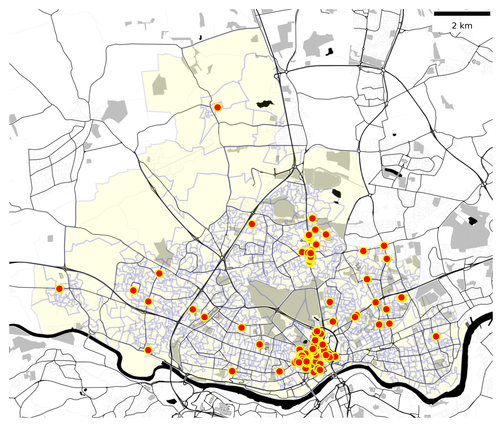
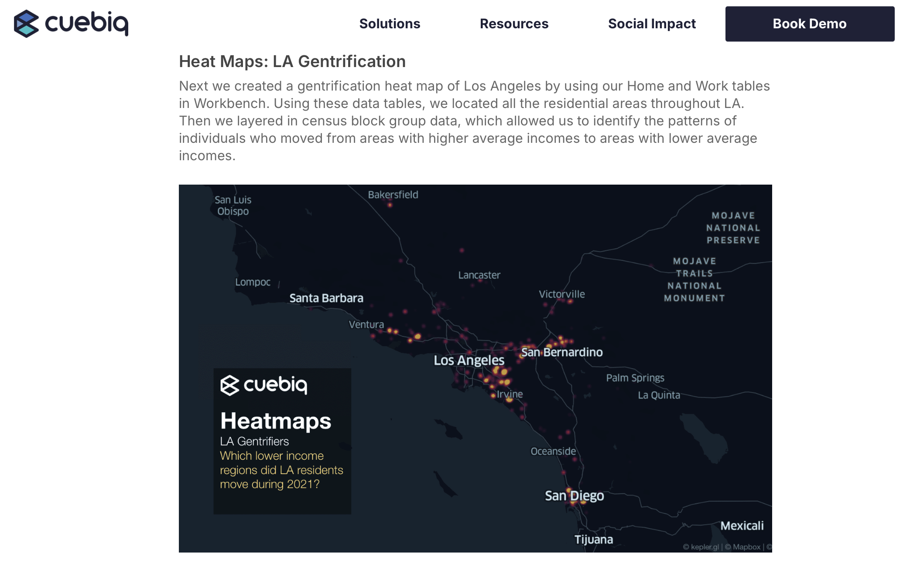
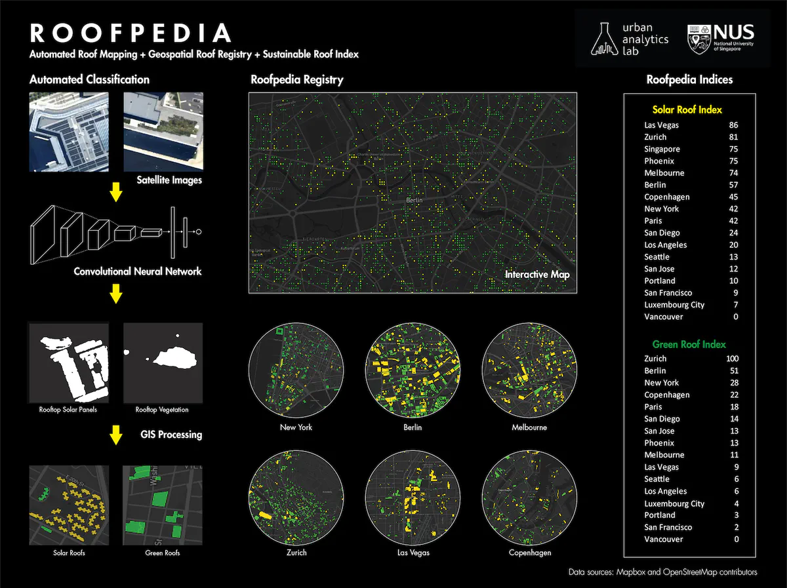

# [1]{style="background-color: #E9BDB4"} Data In,   Data Out

# 

{fig-align="center" width="60%"}

# [2]{style="background-color: #E9BDB4"} Data as Infrastructure

# 

{fig-align="center" width="60%"}

# [3]{style="background-color: #E9BDB4"} Data Chicken, Governance Egg?

# 

{fig-align="center" width="60%"}
