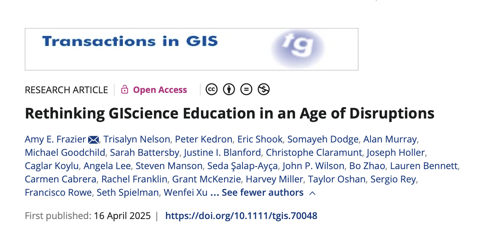
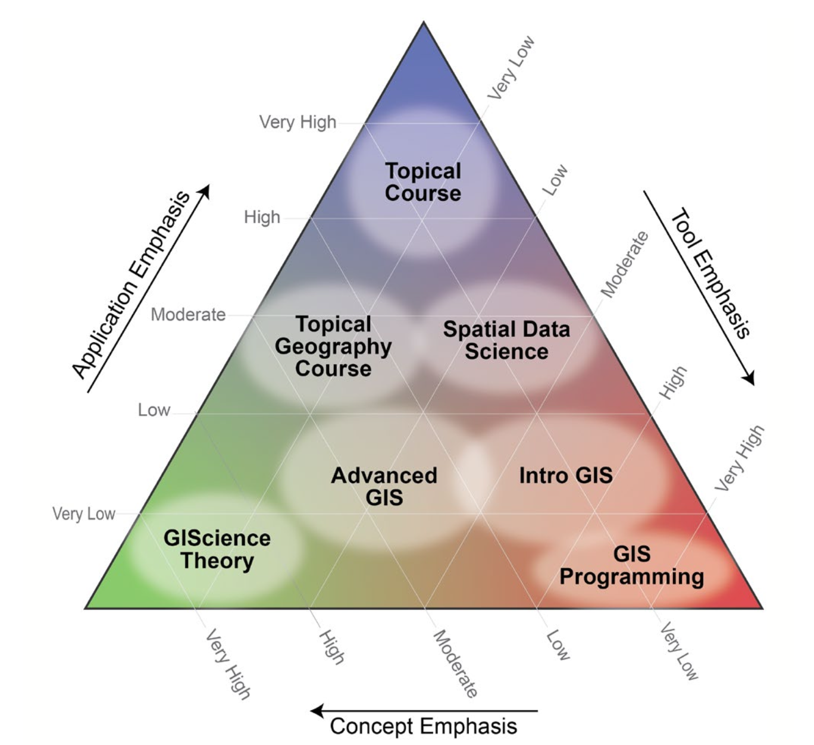

# 

::: {layout="[70,30]"}

{width="30%"}
:::

# What do we teach when we teach "GIS"?

## The only constant is change {.center}

## 

- Artificial Intelligence (AI)
- Data
- High performance and cloud computing

## But also...

- Climate and environmental challenges
- Spatial and social inequalities
- Conflict and political tension

# The big idea

"...a new landscape for training within the discipline that is affecting not only [*what*]{style="background-color: #E9BDB4"} is taught in GIScience courses but also [*who*]{style="background-color: #E9BDB4"} is taught, [*why*]{style="background-color: #E9BDB4"} it is being taught, and [*how*]{style="background-color: #E9BDB4"} it is taught."

## GIS instruction *already* does a lot of heavy lifting

- Tools and methods
- But also complex, "systems" thinking
- And integration across domains and disciplines

## But also...

- Spatial thinking and concepts
- Coding and data science
- Visualization
- Data, data, data

## Our role

- Problem-based learning (many of us already do this!)
- Open and inclusive practices (public teaching meterials, open source software, teaching replication/reproducibility)
- Emphasizing social and ethical dimension

## 

{fig-align="center"}

# A few takeaways

1.  Rapidly changing environment, in terms of teaching *spatial*
2.  "Duty of care" in teaching geographical methods to non-geographers?
3.  Multiplicity of contact points when it comes to instruction (i.e., it's not just faculty or course instructors)

# Thanks!
