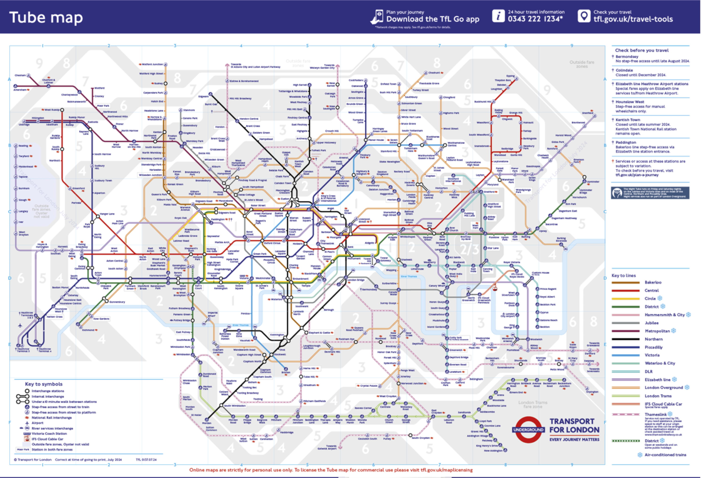
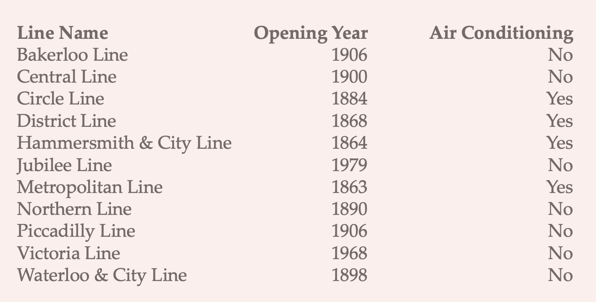
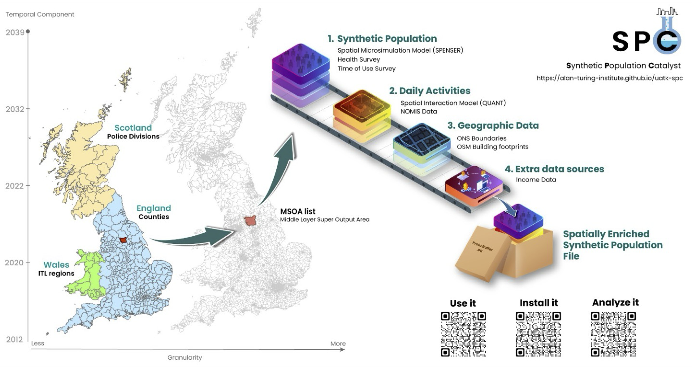
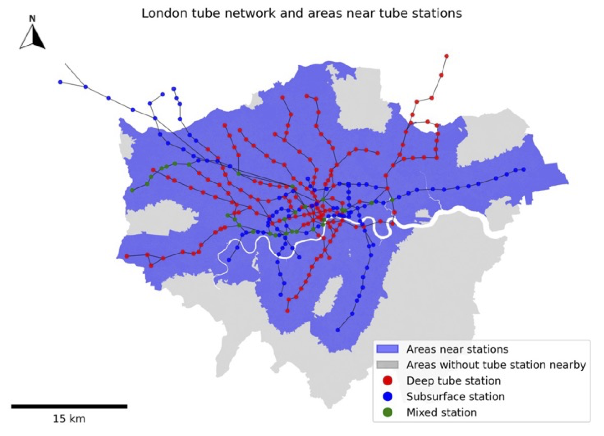
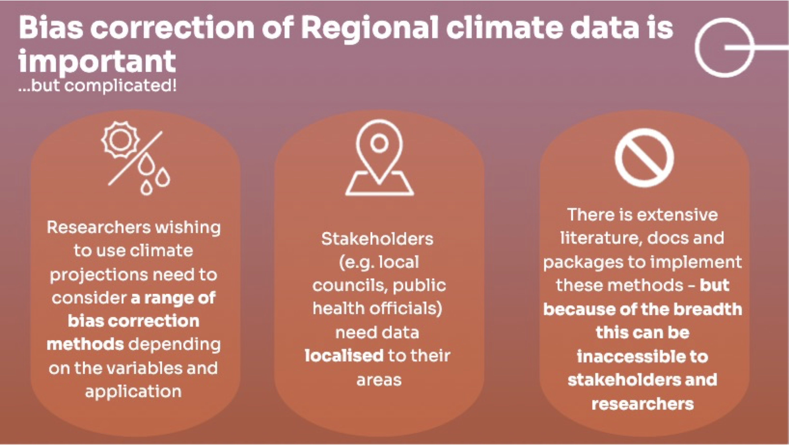
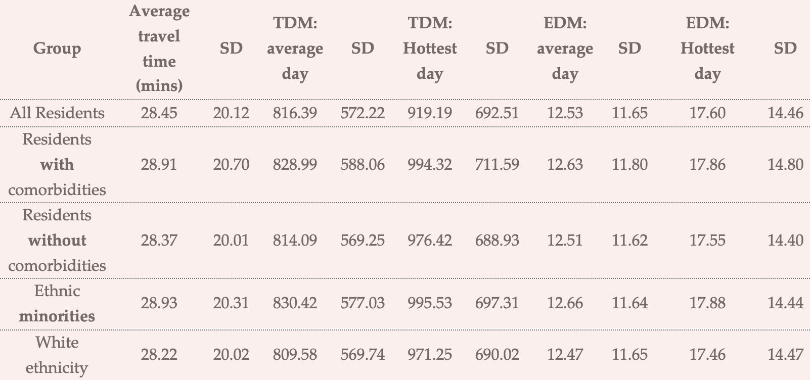
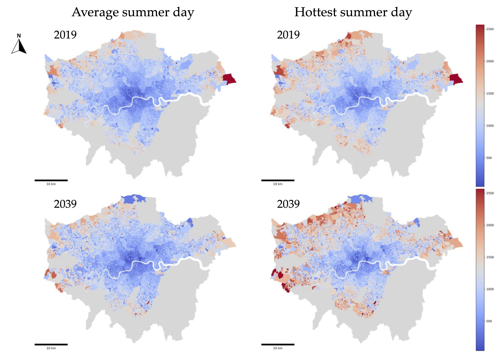
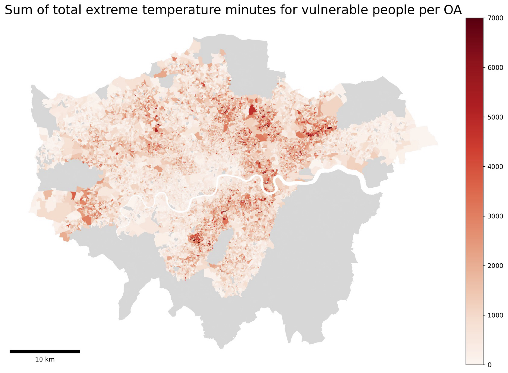
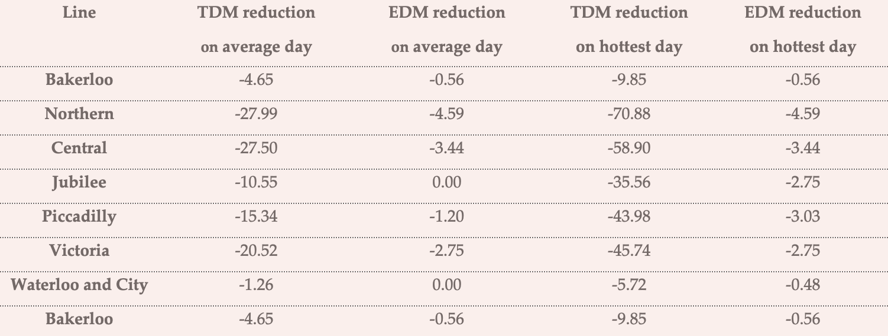

# Origin story {.center}

# 

{fig-align="center"}

# 

{fig-align="center"}

# The big idea {.center}

Public transportation heat exposure in a warming world

## 

One important way in which **health**, **climate change**, and **transportation** intersect

## Case in point: The London Tube

- First Tube line opened in 1863 and is still running as part of the Metropolitan line
- 272 stations
- 11 lines, covering 402 kilometres
- More than five million passengers on the busiest days

##  {.nostretch}

{fig-align="center" width="80%"}

## Future heat on the London Tube {.nostretch}

Only 4 out of 11 London underground lines have air conditioning systems

{fig-align="center" width="70%"}

## Moreover

- The average summer temperature in London is expected to increase by [2.7 °C]{style="background-color: #E9BDB4"} by the 2050s

- Probability of heatwaves could also increase five-fold and they're expected to occur every other year

- By 2070, the mean maximum air temperature in the UK in August is projected to increase by up to [6 °C]{style="background-color: #E9BDB4"} in summer compared to 2018

## Hot is already here: Average station temperatures in London (2019)

{fig-align="center"}

## The question

How can we estimate current and future heat exposure on the Tube *and* who (where) is most affected?

## Simple (and important) spatial question with complex data requirements

- **Who's doing the travelling?** (demographic and health characteristics)

- **Where are they going and how do they get there?** (origin and destination flows)

- **What's the temperature at the station and on board?** (estimated from known station-surface differentials)

## Data

- **Synthetic Population Catalyst** (SPC)--A synthetic population that simulates [individual-level travel behavior]{style="background-color: #E9BDB4"} (home and workplace), travel mode, demographic and socio-economic characteristics that allow us to explore heat vulnerability at the individual level

- **Tube operation timetable**--For [travel times and route estimation]{style="background-color: #E9BDB4"}, we use the timetable provided by Transport for London (TfL) APIs. Provides accurate estimation whether travelers for each OD-pair will take air-conditioned Tube lines

- **Clim-recal**--Estimates [weather and heat wave days]{style="background-color: #E9BDB4"} in the past *and* future on a daily basis in 2.2 km\*2.2 km cells covering the entire UK. Local variation in the dataset is used to estimate heat exposure more accurately.

# Our approach

## 1. Estimate Tube travellers

## Synthetic Population Catalyst Project {.nostretch}

{fig-align="center" width="70%"}

## 

- Start with SPC: [individual-level estimates]{style="background-color: #E9BDB4"} for a range of demographic and socioeconomic attributes, including health, household composition, employment status

- Incorporate Office of National Statistics (ONS) projections for [future population scenarios]{style="background-color: #E9BDB4"}

- Place individuals within Output Areas: the smallest UK census geographical units

- Also combine SPC home and work locations with data from the National Travel Survey (NTS) to [estimate travel mode]{style="background-color: #E9BDB4"}

- Which gives us estimates of individuals (with characteristics) for 2019 and 2039

  - Mostly working age

## 2. Simulate journeys

## 

- We [identify subway commuters]{style="background-color: #E9BDB4"} from the synthetic population with the National Travel Survey

- [Travel routes]{style="background-color: #E9BDB4"} are assumed from/to the nearest Tube stations of their origin and destination Output Area and mapped to the London Tube network built from the operating timetable published by TfL

- [Shortest path line-specific on-board travel times and transit waiting times]{style="background-color: #E9BDB4"} are derived at the station‐to‐station level

  - If more than one station is available and the distance difference is less than 500m, the station with the shortest travel time on the network is picked

##  {.nostretch}

{fig-align="center" width="70%"}

## 3. Calculate journey temperatures

##  {.nostretch}

{fig-align="center" width="70%"}

## Climate data

- [Above-ground temperature data]{style="background-color: #E9BDB4"}: Convection Permitting Model (CPM), part of UK Climate Projections 2018 (UKCP18), published by the UK Met Office
  - This is UKCP18’s finest spatial resolution of climate model (2.2km grid)
- We use [2019 daily high-temperature data]{style="background-color: #E9BDB4"} to represent the current situation and to calculate heat exposure
- For [future scenarios]{style="background-color: #E9BDB4"}, we combine the 5-year projection data from 2037-2042, sorting the days by temperature across years, then generating a synthetic year ranked by high temperature

## 

- In 2019, the average summer day high temperature was 23.36 °C
  - By 2039, that rises to [26.24 °C]{style="background-color: #E9BDB4"}, indicating an increase of nearly 3 °C for average summer highs.
- In 2019, the hottest day reached 29.76 °C
  - By 2039, the peak climbs to [35.38 °C]{style="background-color: #E9BDB4"}
- Largest differences between the future and baseline curves are often observed during summer peaks

## Estimating journey temperatures

- Station and journey segments are linked to the above-ground temperature data

- **Station‐level temperatures**--the sum of surface temperatures and line-specific temperature offsets derived from TfL data indicating how much warmer or cooler the train line is relative to the surface

- **Journey segment temperatures**--the average of origin and destination station temperatures

## Creating heat exposure indicators

- Calculated by combining temperature values with the corresponding travel times (on-board) and transfer times (while waiting at stations)

  - **Total Degree Minutes (TDM)**--capturing [cumulative thermal stress]{style="background-color: #E9BDB4"} as the time‐temperature product, where longer exposure at higher temperatures yields larger values

  - **Extreme Degree Minutes (EDM)**--quantifying [total time spent in extremely hot environments]{style="background-color: #E9BDB4"} (above 30 °C), potentially linked to acute health risks

## 

- By matching station-to-station heat exposure from home locations to work locations provided from commuting journeys, we can estimate [individual-level heat exposure]{style="background-color: #E9BDB4"} along with individual characteristics

- [Network‐level heat exposure]{style="background-color: #E9BDB4"} is obtained by summing or averaging Origin‐Destination (OD) pair‐specific indicators across the entire Tube system, yielding heat exposure indicators for the London Underground System

- We define the following as vulnerable: BMI\>35 or having either diabetes, high blood pressure, or cardiovascular diseases

- 387,876 London residents (mainly working age) were included in the analysis, with an average daily travel time of 28.01 minutes (2019)

# Results

## Individual-level

## 2019

- For all residents, the mean Total Degree Minutes (TDM) on a typical day was 761.98, rising to 881.10 degree\*mins on the hottest day

- Findings indicate the risk sharply increases on hot days: both TDM and EDM jump considerably from the average day to the hottest day

## 2039

- Average travel time of 28.45 minutes--slightly longer than the 28.01 minutes observed in 2019

- Both Total Degree‐Minutes (TDM) and Extreme Degree Minutes (EDM) are forecast to rise for *all* groups compared with 2019

- Among all residents, the mean TDM on a typical day [increases from 761.98 in 2019 to 816.39 in 2039]{style="background-color: #E9BDB4"}, while on the hottest day, it grows from 881.10 to 919.19.

- EDM on an average day nearly doubles, from [5.77 to 12.53]{style="background-color: #E9BDB4"}. The hottest‐day increase is more modest (17.30 to 17.60).

  - Almost all deep Tube lines in 2019 exceeded the extreme threshold we set on the hottest day, so even if the temperature for the hottest days is much higher in 2039, there is not much space for EDM to increase

## The future of heat: cross-group comparison for 2039

{fig-align="center"}

## Neighborhood level

## 

- Neighborhood-level travel heat exposure is derived through aggregation of residential locations of individuals to the Output Area level

- Most affected areas tend to be the [outer ring of London]{style="background-color: #E9BDB4"}, suggesting that residents with longer commutes, or those using particularly warm Tube lines, will experience the largest increases in cumulative heat load

- By 2039, on the hottest day, EDM escalates further still, with large swaths of outer London turning red, signifying substantially increased heat stress.

## Total degree minutes (TDM)

Cumulative heat load during tube journeys

{fig-align="center"}

## Extreme degree minutes (EDM)

Time passengers spend in extremely hot conditions during Tube travel

{fig-align="center"}

## Overlaps between spatial inequality and vulnerability

## 

{fig-align="center"}

## 

- Certain areas of Greater London—especially in the northeast and, to a lesser degree, in the southern boroughs—bear considerably higher heat exposure burdens

- [Confluence of spatial inequality and population vulnerability]{style="background-color: #E9BDB4"}, with disadvantaged communities facing longer or more intense heat exposure when travelling on deep Tube lines, especially Central and Northern Lines

- Heightened exposures coincide with populations who may have limited capacity to cope, due to factors such as restricted travel options, lack of air‐conditioned alternatives, or an elevated baseline risk of heat‐related illness

# What if more train air conditioning is installed?

## 

{fig-align="center"}

# Discussion

## 1: Drivers of inequality in heat exposure

- Clear geographical variations in heat exposure for Tube travelers in both time periods

  - Would be interesting to allocate travelers to specific lines to estimate population (and neighborhood) benefits of installing AC
  - Would also be helpful to look at neighborhood characteristics

- Peripheral areas have notably higher levels of “extreme minutes” and “total temperature minutes”

  - These disparities are still more pronounced in future projections for 2039, suggesting that existing inequalities may deepen with ongoing climate change

## What's driving this observed geographic unevenness?

- **Infrastructure and line characteristics:**

  - Older, deeper lines are prone to higher on-board temperatures

  - Areas dependent on these lines (e.g., those lying along certain radial routes) show higher overall exposure

- **Journey length:**

  - Outer London residents accumulate much more heat exposure compared to central London residents

  - Many of these areas have fewer transport alternatives—-particularly air‐conditioned services

# 2: AC for all!

- AC would provide significant improvements in thermal comfort, particularly on the hottest days

- Results suggest that prioritizing other deep-level lines (along with Piccadilly) for AC, such as the Northern, Central, and Victoria lines, is crucial for broader heat exposure mitigation

# Conclusions

- Our research highlights the urgent need for targeted interventions to mitigate heat exposure risks on London's Underground network

- "Hot is already here" and the future is even warmer

  - Paired with aging populations (which we don't address but are obviously relevant) and the need for an energy transition, focusing on making public transportation work...and be healthy...for all makes good policy sense

- Our findings also highlight the significant spatial inequalities in heat exposure, revealing heightened vulnerabilities among passengers commuting from outer boroughs, particularly those with longer journeys or limited transport alternatives

# Final thoughts

- Trickiness of estimation but lots of useful **data** that can be brought to bear

- An exemplary example of where geographers have a lot to contribute

- **But** also some of this (e.g., on-board temperatures) should be being measured directly!

# The End.

::: aside
Thank you!!
:::
