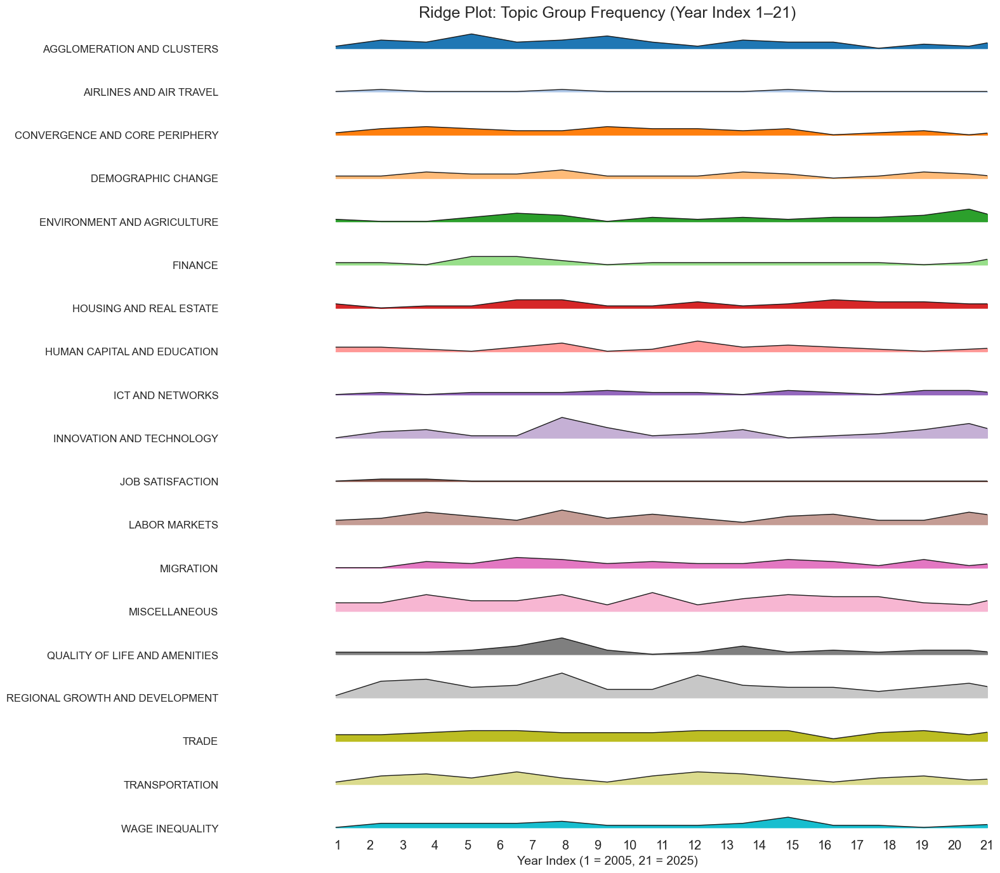
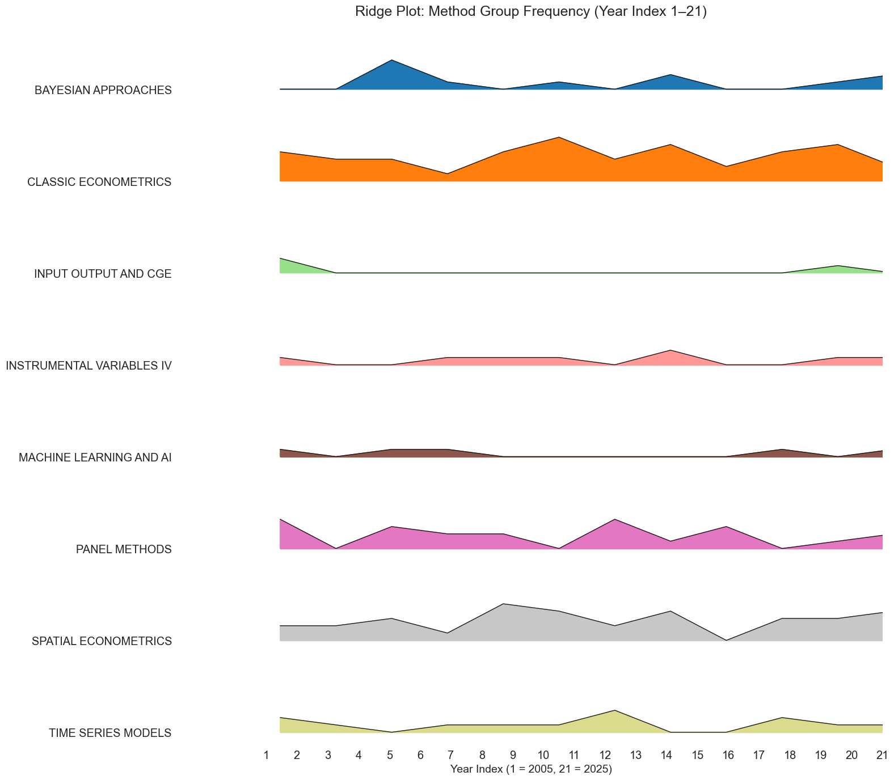
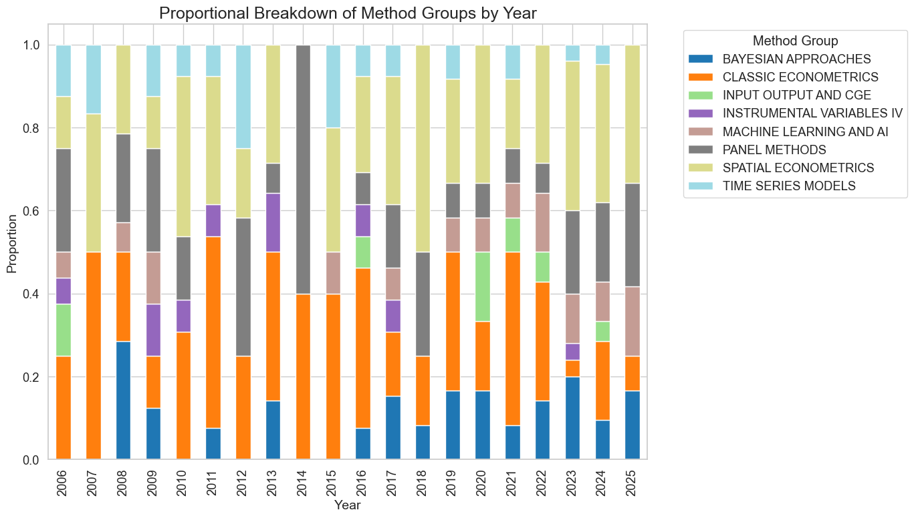
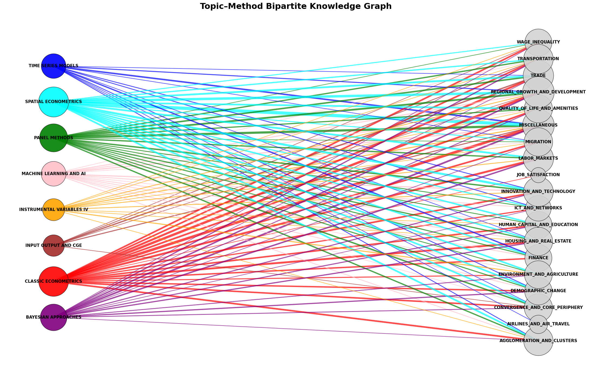
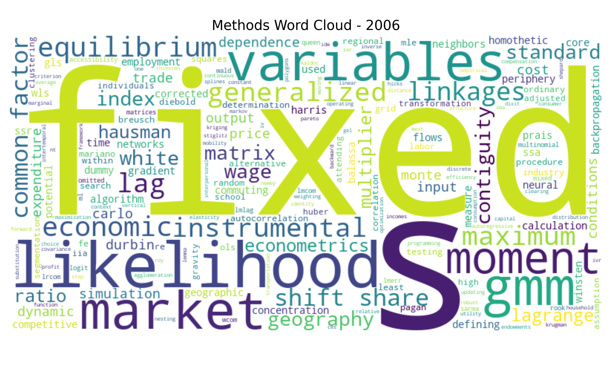
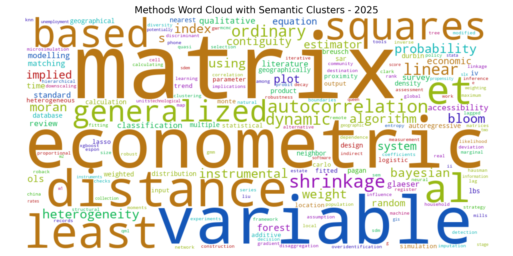
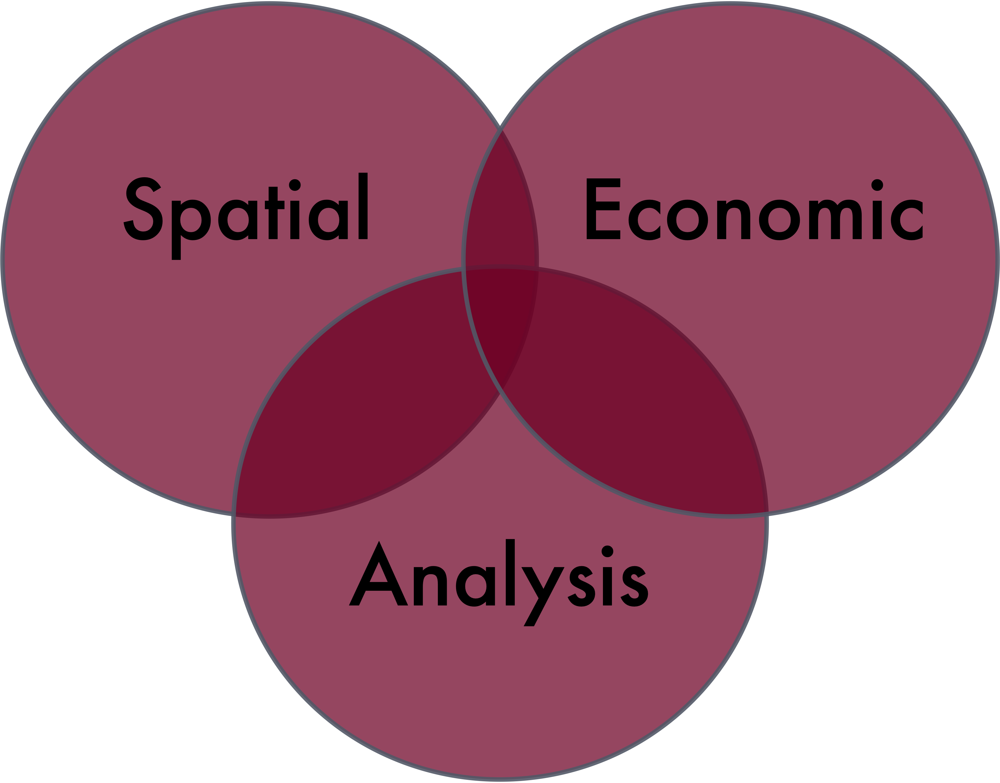
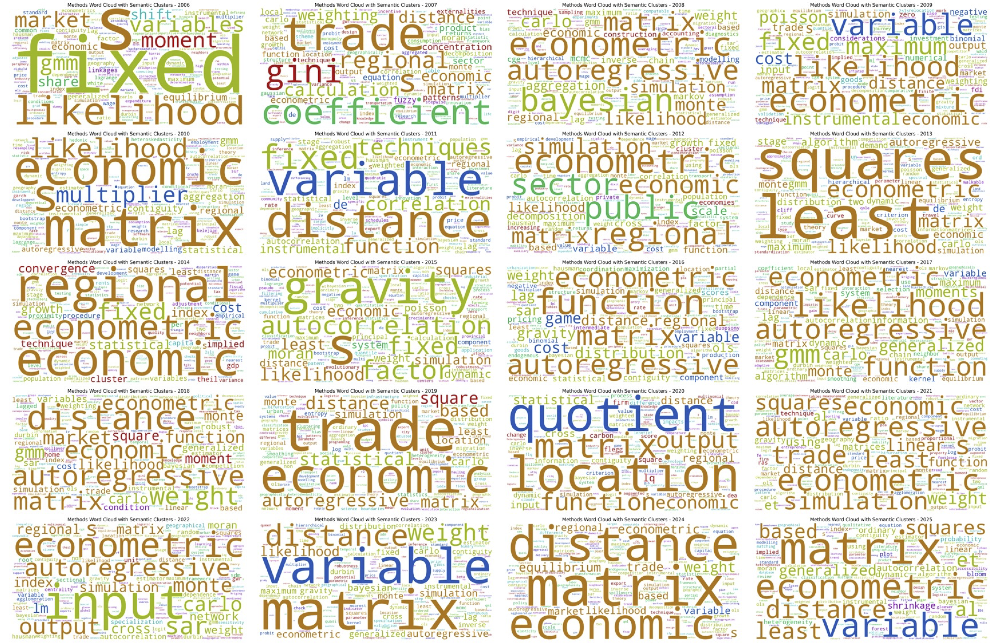

# What do we talk about when we talk about [“spatial economic analysis”]{style="background-color: #F0E68C"}?

# An age-old question:   ["how do we know what we know?"]{style="color: #800020"}

\
\

::: aside
This is a talk with hopefully a little something for everyone (not only the spatial economic analysts in the room!)
:::

# What we mean by [Spatial]{style="color: #800020"}

## 

- Role of location or place
- Geographical variation or disparities (across cities, regions, or countries)
- Context
- Spillovers
- Interactions
- Networks

\

...and as [statistical artifact]{style="background-color: #F0E68C"}

# What we mean by [Economic]{style="color: #800020"}

## 

- Obvious topics like economic growth and development
- Roles of economic sectors, firms, innovation, and entrepreneurship

\

...but also [well-being, quality of life, and human capital]{style="background-color: #F0E68C"}

# What we mean by [Analysis]{style="color: #800020"}

## "Analysis" comes in lots of flavours

- Empirical or case studies
- Descriptive
- Spatial analytical or geocomputational
- Machine learning and artificial intelligence

\

...or a marriage of spatial economics and economic geography   [(*Spatial Economic Analysis* flavour)]{style="background-color: #F0E68C"} -- so, fairly econometrics orientated

# Another way of thinking about [analysis]{style="background-color: #F0E68C"}

\
\

If we're talking about the *SEA* marriage, how about [old, new, borrowed, and BLUE]{style="color: #800020"}

## [Old]{style="color: #800020"} (your mother's spatial economic analysis tools)

- Input-Output
- Computable General Equilibrium Models (CGE)
- Shift-share analysis and location quotients
- Spatial interaction/gravity models
- Spatial autocorrelation/regression

## [New]{style="color: #800020"}(er)

- Bayesian approaches
- Instrumental Variables (IV)
- Geographically Weighted Regression (GWR)
- Advanced Spatial Econometrics
- Genetic algorithms
- Neural networks
- Clustering (e.g., k means)
- Microsimulation

## [Borrowed]{style="color: #800020"} (your PhD student's spatial economic analysis tools)

- Machine learning/Artificial Intelligence (AI)
  - Natural Language Models
  - Large Language Models (LLMs)
  - Computer vision
  - Foundation models

## [BLUE]{style="color: #800020"} (Best Linear Unbiased Estimator)

- Ordinary Least Squares (OLS)

\
\

Old school (not much else to report on this)

# A little bit of revealed preference

[(for a treat)]{style="color: #800020"}

## Where better to look than our journal, [*Spatial Economic Analysis*]{style="background-color: #F0E68C"}

- Founded in 2006

- With hundreds of papers now published (428)

- Good proxy for what we consider to be [spatial economic analysis]{style="color: #800020"}

## Bibliometric analysis and topic modelling

- Similar to qualitative analysis but with an entire corpus

- And automated

- We use a Large Language Model (LLM--Gemma-3-27B-Instruct)

- Our corpus is all *SEA* papers with the exception of virtual special issue papers and issue editorials

## So what does a machine think spatial economic analysis is?

And how has this changed over the past 20 years?

## 

{fig-align="center" width="70%"}

## 

{fig-align="center" width="70%"}

## 

{fig-align="center" width="70%"}

## 

{fig-align="center" width="70%"}

# Closing thoughts: left behind methods?

## How it started

{fig-align="center" width="70%"}

## How it's going

{fig-align="center" width="70%"}

## Union versus intersection

{fig-align="center" width="50%"}

## What do we think about academic fashions in methods (and topics)?

\
\

It's one thing not to re-invent the wheel. What about a vehicle that never really changes its wheels?

\
\
Not about methodological [substitution]{style="background-color: #F0E68C"}, but rather [complementarity]{style="background-color: #F0E68C"}

## Where are the new forms of data?

\
\

Like web-scraping, crowdsourcing, GPS, and satellite imagery

## Evolution as survival mechanism

The only thing constant is change.

# [The End.]{style="color: #800020"}

::: aside
Thank you!!
:::

# 

{fig-align="center" width="70%"}
