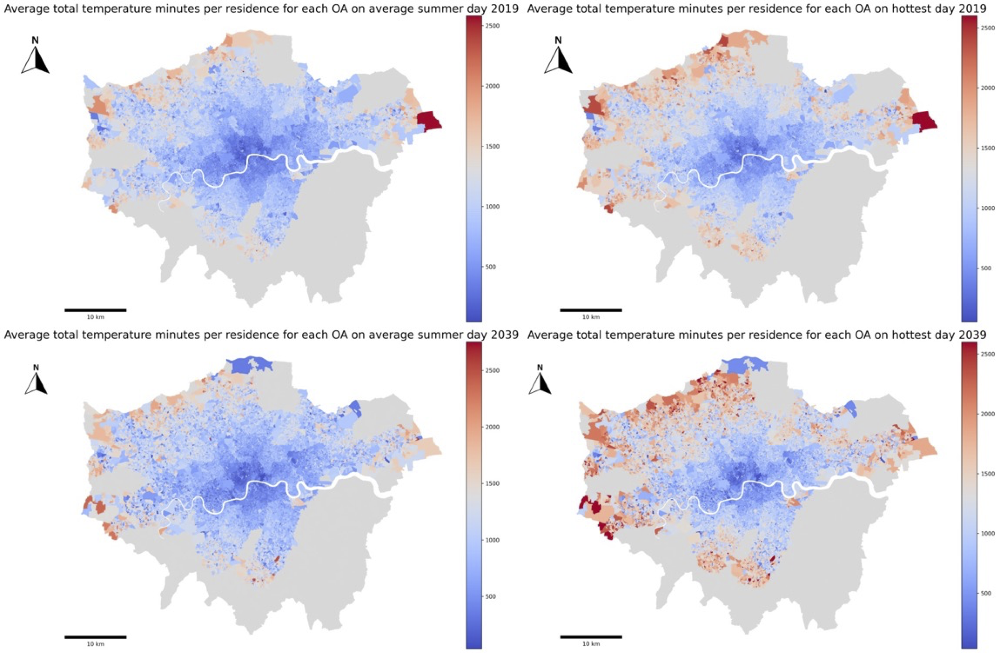

# How do we create (more) liveable cities?

## Defining goals

e.g., equity, wellbeing, health, sustainability

## Understanding why things are the way they are

(this is complicated!)

## Being deliberate with data

moving beyond convenient, *found* data

## Matching methods and data to the problem

(this is not always complicated!)

# Quick example

## Thinking about the ways in which **health**, **climate change**, and **transportation** intersect

## Case in point: The London Tube

- 272 stations
- 11 lines, covering 402 kilometres
- More than five million passengers on the busiest days

## Future heat on the London Tube

- Only 4 out of 11 London underground lines have air conditioning systems

- The average summer temperature in London is expected to increase by 2.7 degrees Celsius by the 2050s

- The probability of heatwaves could also increase five-fold and they're expected to occur every other year

- By 2070, the mean maximum air temperature in the UK in August is projected to increase by up to 6 °C in summer compared to 2018

## Hot is already here

{fig-align="center"}

## The big idea

How can we estimate current and future heat exposure on the Tube *and* who (where) is most affected?

## Simple (and important) question with complex data requirements

- **Who's travelling?** (demographic and health characteristics)

- **Where are they going?** (origins and destinations)

- **What do journey temperatures look like?** (estimated from known station-surface differentials)

## Exciting data and analytical tools at our disposal

- **Synthetic Population Catalyst** (SPC)--A synthetic population that simulates individual-level travel behaviour (homeplace and workplace), travel mode, person and socio-economic factors that allow us to explore heat vulnerability at the individual level

- **Tube operation timetable**--For travel times and route estimation. Provides accurate estimation whether travellers for each OD-pair will take air-conditioned Tube lines.

- **Clim-recal**--Estimates weather and heat wave days in the past *and* future on a daily basis in 2.2 km\*2.2 km cells covering the entire UK. Local variation in the dataset is used to estimate heat exposure more accurately.

## A preliminary sense of findings

{fig-align="center" width="80%"}

## 

- The inequality of heat exposure risk is significant in spatial terms

- Trickiness of estimation but lots of useful **data** that can be brought to bear

- **But also** some of this should be being measured directly!

# Takeaways

1.  Question first, then methods/data

2.  Just because we can, should we?

3.  Use the best tools for the problem

4.  Data, data, data

5.  Problem-driven innovation

## {fig-align="center"}
