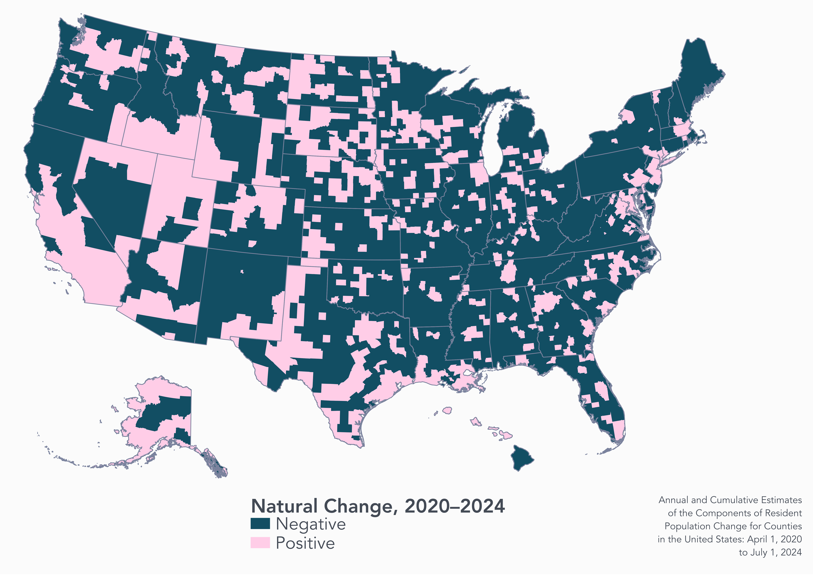
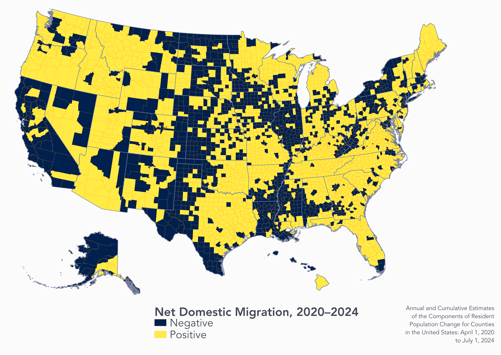
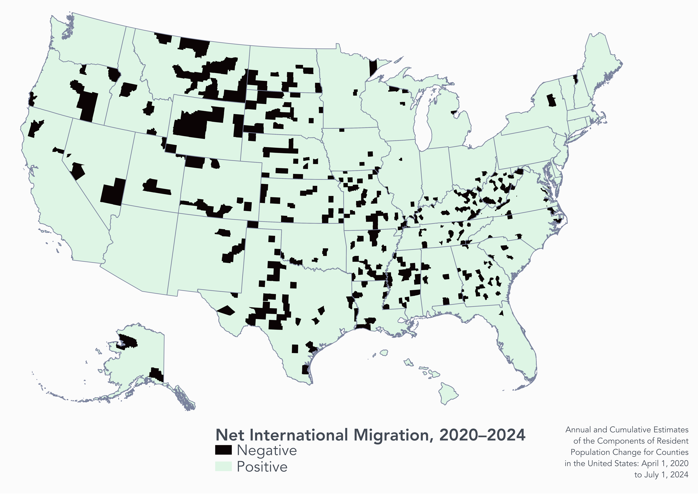

# The persuasive case for caring about (regional) fertility

## 1. 

Today's kids are tomorrow's workers, innovators, and caregivers

## 2.

Today's kids are tomorrow's inter-regional migrants

\

\

::: aside
And international migrants! And international students!
:::

## 3. 

Places are inter-dependent

::: aside
What happens over there matters over here. This is regional science bread and butter! 
:::

## 4. 

Policies are inter-dependent too

::: aside
Thinking about local policy as [fertility neutral]{style="background-color: #F0E68C"}
:::

## 5. 

Perhaps most importantly: fertility as an indicator of regional wellbeing (up to a point)

## 6. 

Geography matters for studying fertility

::: aside
Core versus periphery, but also across spatial and temporal scales

Or spatial variations in fertility **decline** versus **delay**
:::

# Challenges of low fertility also matter closer to home

#

{fig-align="center" width="70%"}

#

{fig-align="center" width="70%"}

#

{fig-align="center" width="70%"}

# Some last thoughts on Alessandra's talk

- The risks attendant to demographic policy for demographic policy's sake (pro-natalism is kind of weird)

- The added dimension of demographic compositional change

- Role for regional science: regional development policy as demographic policy

::: aside
The last one is a key point Alessandra is making.
:::

# The End.

::: aside
Thank you!! And thank you, Alessandra!!
:::
