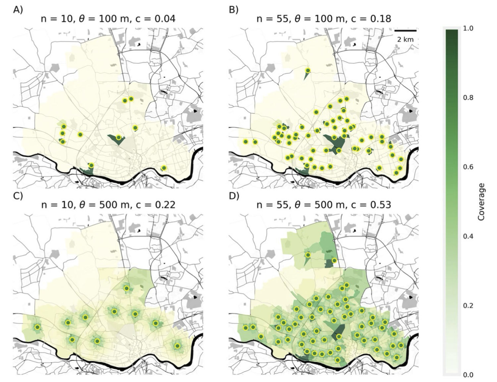
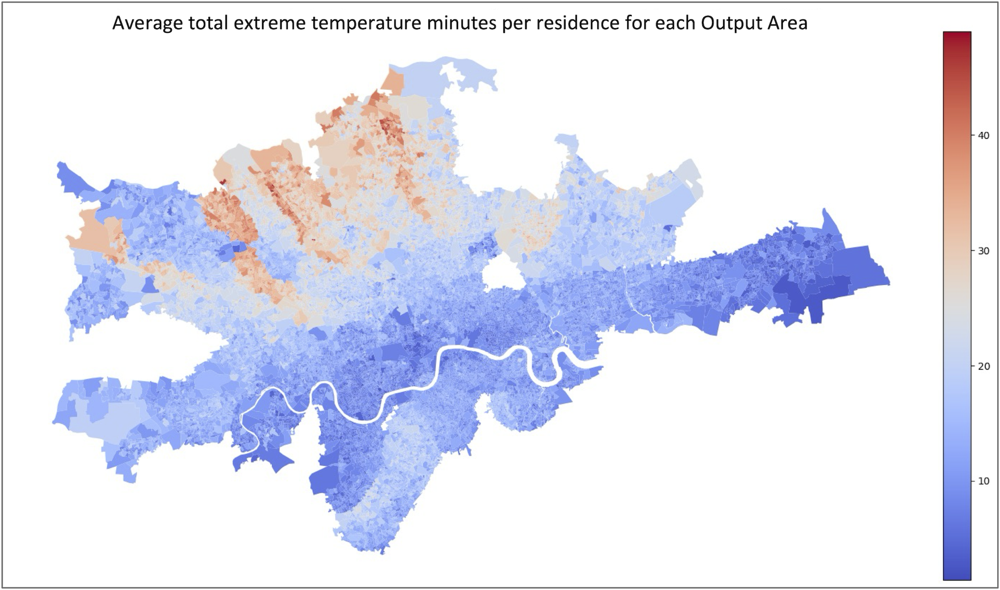

#  {.center}

::: r-fit-text
These are a Few of My Favorite Things
:::

::: aside
Some concept-forward slides about stuff that requires a lot of quantitative methods
:::

# Prologue {.center}

What is *spatial inequality*?

The **observation of uneven attributes or outcomes over space**, for sure. But also the *processes* and *structures* producing that unevenness, as well as the *impacts* of those inequalities.

# Thing 1 {.center}

Spatial inequality and the smart city

## 

Thinking about how **emerging technologies** intersect with the **spatial demography of cities** to exacerbate, reproduce, and generate inequalities across areas or groups.

## Especially placement of sensors in the urban landscape

- Sensor coverage and “sensor deserts”
- Who’s in the “gaps”
- Equitable decision-making

## Why should we care about sensors and sensor networks?

## The big idea

How can we support informed and equitable decision-making around sensor placement, especially what criteria *ideal* networks might satisfy and the inevitable trade-offs involved?

## Geographers have methods for this! (yay us!)

- What is the ”best” allocation of *n* sensors, given a particular goal?

- Decision support tools that visualize options and trade-offs

## 

## No fancy data here and well-known methods

\
\
But should make us think:

a)  how are our data produced?

b)  how can we do better?

# Thing 2 {.center}

Public transportation heat exposure in a warming world

## {fig-align="center"}

## 

Thinking about the ways in which **health**, **climate change**, and **transportation** intersect

## Case in point: The London Tube

## Future heat on the London Tube

- Only 4 out of 11 London underground lines have air conditioning systems

- The average summer temperature in London is expected to increase by 2.7 degrees Celsius by the 2050s

- The probability of heatwaves could also increase five-fold and they're expected to occur every other year

- By 2070, the mean maximum air temperature in the UK in August is projected to increase by up to 6 °C in summer compared to 2018

## Hot is already here: Average station temperatures in London (2019)

{fig-align="center"}

## The big idea

How can we estimate current and future heat exposure on the Tube *and* who (where) is most affected?

## Simple (and important) question with complex data requirements

- Travel flows (origins and destinations)

- Who's travelling? (demographic and health characteristics)

- What's the temperature on board? (estimated from known station-surface differentials)

## Exciting geographical tools

- **Synthetic Population Catalyst** (SPC)--A synthetic population that simulates individual-level travel behaviour (homeplace and workplace), travel mode, person and socio-economic factors that allow us to explore heat vulnerability at the individual level

- **Tube operation timetable**--For travel times and route estimation, we use the timetable provided by TfL APIs. Provides accurate estimation whether travellers for each OD-pair will take air-conditioned Tube lines.

- **Clim-recal**--Estimates weather and heat wave days in the past *and* future on a daily basis in 2.2 km\*2.2 km cells covering the entire UK. Local variation in the dataset is used to estimate heat exposure more accurately.

## Preliminary results (a sense of where we're heading) {.nostretch}

{fig-align="center" width="80%"}

## 

- The inequality of heat exposure risk is significant in spatial terms

- Trickiness of estimation but lots of useful **data** that can be brought to bear

- **But** also some of this should be being measured directly!

# Epilogue

## Complex spatial inequality challenges require complex approaches[^1]

[^1]: not necessarily complex methods

- Inter-disciplinarity
- Geography
- A lot of social science under the hood [^2]\
  \

[^2]: starting with a question, building with theory, and then selecting the most appropriate methods

## The question chooses the method.

(Not the other way around)

# The End.
