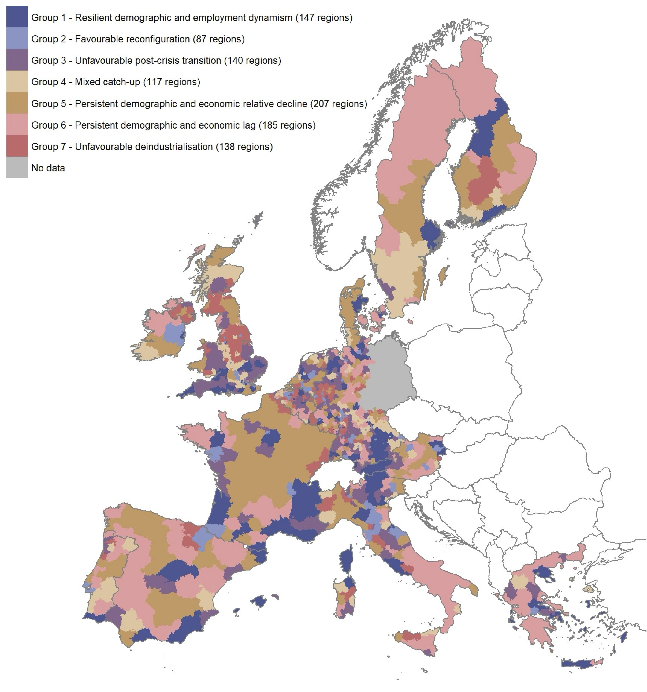
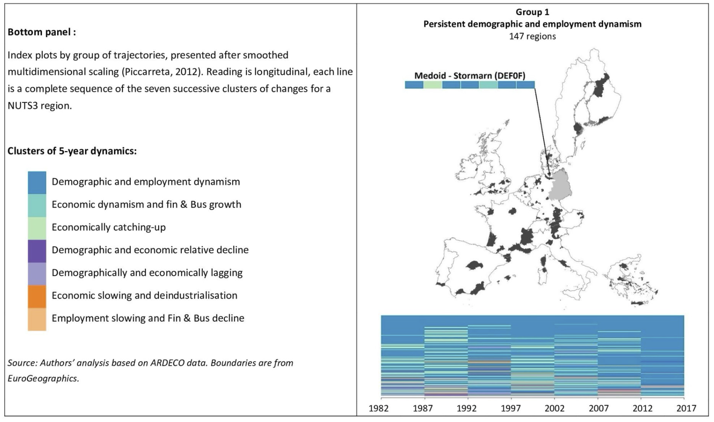
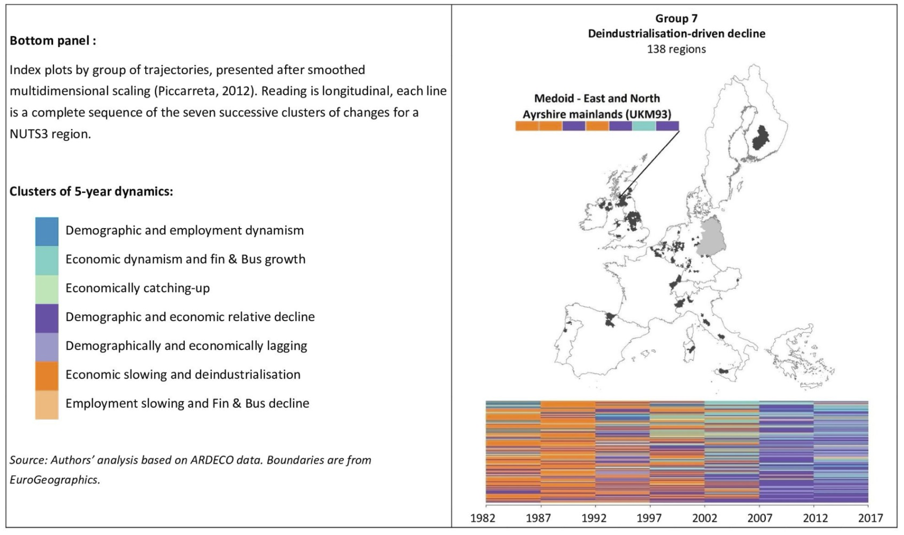
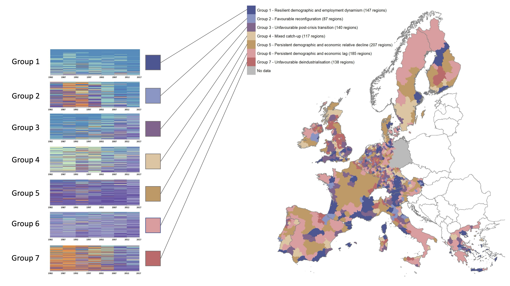
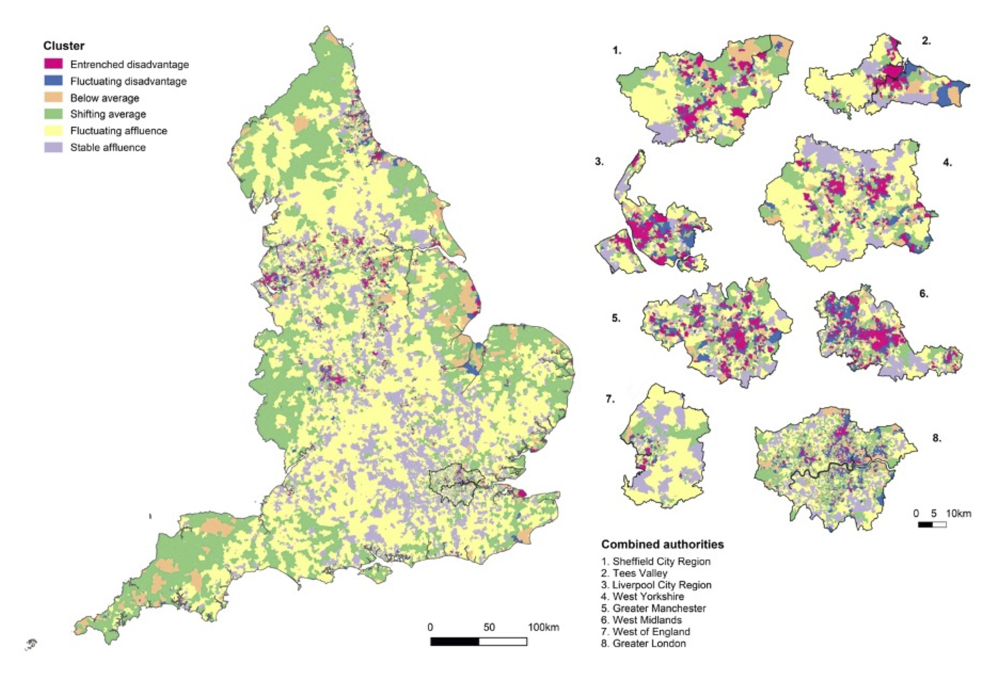
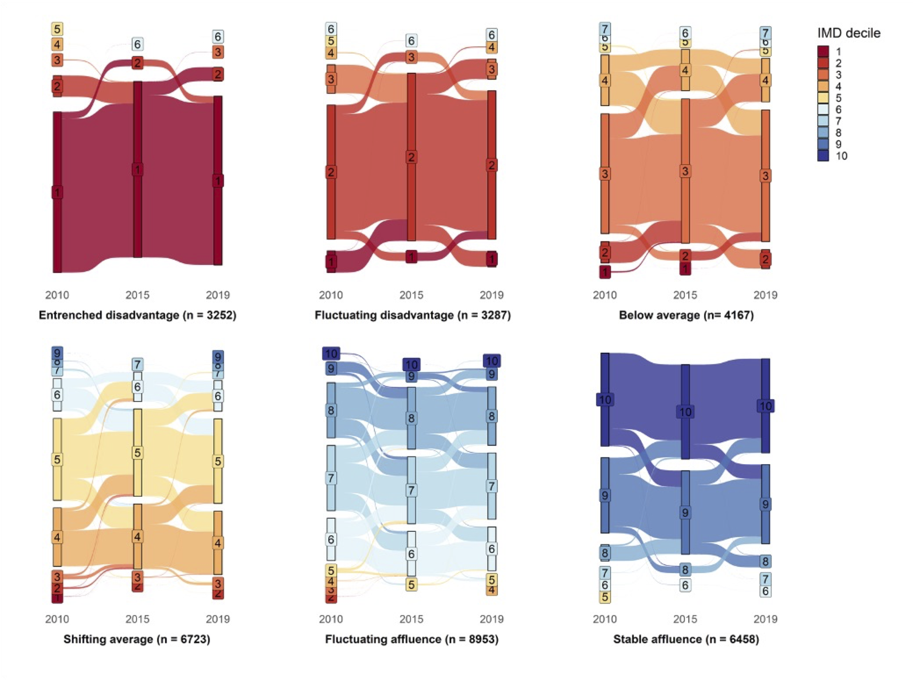

```{r}
#| label: map-setup
#| include: false

knitr::opts_chunk$set(dev.args = list(bg = "transparent"))

library(sf)
library(ggplot2)
library(dplyr)

# Northumberland v1.0 palette
pal_cat  <- c("#3A6828", "#6A9CB5", "#C4704A", "#C49820",
              "#7AAA8A", "#A87898", "#7A3040", "#6A7278")
pal_div  <- c("#2A5C20", "#5A8840", "#A8C880", "#EAE4D0",
              "#D4A848", "#A07820", "#5C4008")
pal_seq  <- c("#EEF0E4", "#C4D0A0", "#86A855", "#4A7840",
              "#2E5828", "#163010")

theme_map_north <- function(base_size = 12) {
  theme_void(base_size = base_size, base_family = "Futura") +
    theme(
      plot.background  = element_rect(fill = "transparent", color = NA),
      panel.background = element_rect(fill = "transparent", color = NA),
      plot.title    = element_text(face = "bold", color = "#2E2420",
                                   size = rel(1.3),
                                   margin = margin(b = 6)),
      plot.subtitle = element_text(color = "#7A6C68", size = rel(0.95),
                                   margin = margin(b = 10)),
      plot.caption  = element_text(color = "#7A6C68", size = rel(0.75),
                                   hjust = 0),
      legend.title  = element_text(color = "#2E2420", face = "bold"),
      legend.text   = element_text(color = "#1A1210"),
      legend.position = "right"
    )
}
```

# What does it mean to be a [Left Behind Place]{style="color: #800020; background-color: #F0E68C;"}?

# 

```{r}
#| label: ch-data
#| include: false

ch_path <- "Zurich_maps/Zurich_maps.gpkg"

# 'query =' bypasses a stale feature-count cache on the Cantons layer
munis   <- st_read(ch_path, layer = "municipalities",        quiet = TRUE) |> st_zm()
nation   <- st_read(ch_path, layer = "national_border",        quiet = TRUE) |> st_zm()
water   <- st_read(ch_path, layer = "water",                 quiet = TRUE) |> st_zm()
```

```{r}
#| fig-width: 8
#| fig-height: 5
#| out-width: "80%"

ggplot() +
  geom_sf(data = nation, fill = "#800020", color = "#6A7278", linewidth = 0.1) +
  geom_sf(data = water,   fill = "#6A9CB5", color = NA, alpha = 0.55) +
  theme_map_north() +
  labs(caption = "Source: swissBOUNDARIES3D / swisstopo")
```


## A [state of being]{style="background-color: #F0E68C"}: places characterised by disadvantage and deprivation and lacking opportunity 

## The [outcome of an ongoing process]{style="background-color: #F0E68C"}: uneven growth, development, or progress that benefits some [areas]{style="color: #800020"} and [people]{style="color: #800020"} over others, leaving select places behind

## [Spatial structures of neglect]{style="background-color: #F0E68C"}---incidental or deliberate---that peripheralise or distance regions from each other

::: aside
Similar to political or economic polarisation, except divergence in wellbeing
:::

# But what does this really mean?

## Speaks to the importance of different ways of [knowing]{style="color: #800020"}

## Lived experience obviously matters

## But we also seek a sense of universality
as opposed to egocentricity

#

{fig-align="center"}

# So what do [numbers]{style="color: #4e5767"} do for us?

# Provide evidence for action

## First and foremost, a quantitative approach helps document common experience

##

{fig-align="center"}

# Illuminate trajectory

## Being left behind suggests a [temporal process]{style="background-color: #F0E68C"}

##

{fig-align="center"}

##

{fig-align="center"}

# Formalise dimensions

## Translating human experience into numbers requires names, labels, and data

##

{fig-align="center"}

# It also pushes us to ask questions about [spatial scale]{style="background-color: #F0E68C"}

## What do we mean by [place]{style="color: #800020"}? 

\
\

A region? A city? A neighbourhood?

##

{fig-align="center"}

# And consider dynamics

## Spatial, social, and economic

##

{fig-align="center"}

# Concluding thoughts

- Numbers---what we choose to measure---reflect what we value in society
- Numbers can speak to the power of collective human experience
- Quantitative analysis acts as an impetus to put into words, theories, and metrics how we think the world might work
- Numbers and quantitative analysis as [evidence]{style="background-color: #F0E68C"}

# The End.

\

\

Thank you!!

